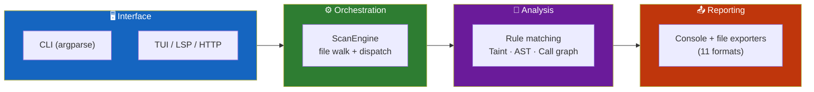
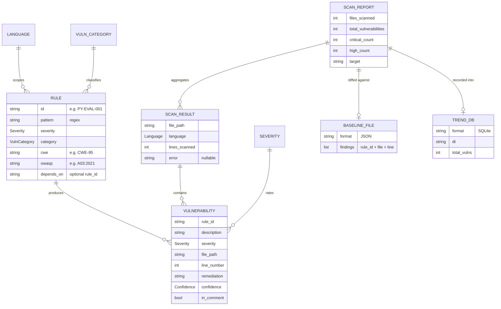
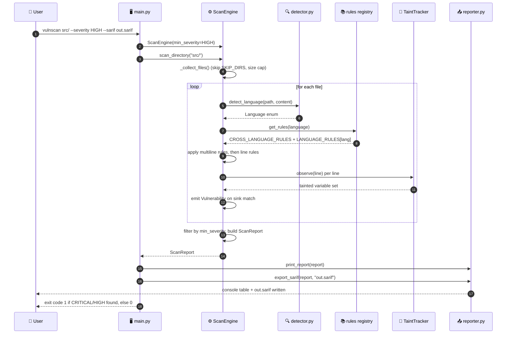
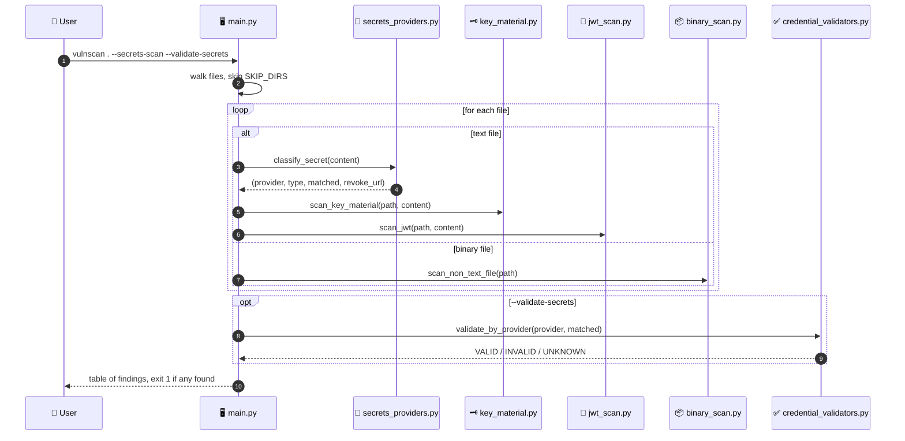
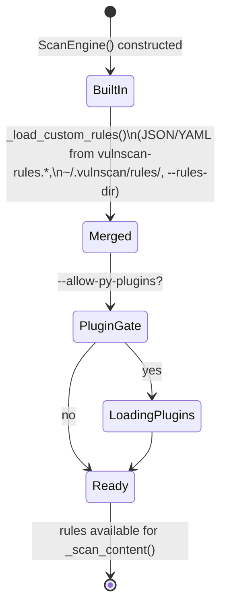
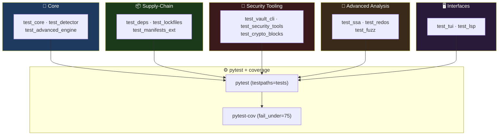

<div align="center">

**🌐 Choose Language / Selecione o Idioma / Elija el Idioma**

[](README.md)&nbsp;&nbsp;&nbsp;[](README_PT.md)&nbsp;&nbsp;&nbsp;[](README_ES.md)

</div>

---

<div align="center">

```
██╗   ██╗██╗   ██╗██╗     ███╗   ██╗███████╗ ██████╗ █████╗ ███╗   ██╗
██║   ██║██║   ██║██║     ████╗  ██║██╔════╝██╔════╝██╔══██╗████╗  ██║
██║   ██║██║   ██║██║     ██╔██╗ ██║███████╗██║     ███████║██╔██╗ ██║
╚██╗ ██╔╝██║   ██║██║     ██║╚██╗██║╚════██║██║     ██╔══██║██║╚██╗██║
 ╚████╔╝ ╚██████╔╝███████╗██║ ╚████║███████║╚██████╗██║  ██║██║ ╚████║
  ╚═══╝   ╚═════╝ ╚══════╝╚═╝  ╚═══╝╚══════╝ ╚═════╝ ╚═╝  ╚═╝╚═╝  ╚═══╝
        Multi-language static analysis for vulnerabilities, secrets & supply chain
```

---

[](https://www.python.org/)
[](https://github.com/Textualize/rich)
[]()
[]()
[]()
[](.github/workflows/ci.yml)

<br/>

> **A single-dependency Python CLI that turns a folder of source code into a**
> ranked list of vulnerabilities, leaked secrets, vulnerable dependencies and SARIF findings.

<br/>


</div>

---

## 📑 Table of Contents

<details>
<summary>▶️ <strong>Click to expand / collapse this section</strong></summary>

<table>
<tr>
<td valign="top" width="50%">

**🏗️ System**
- [Overview](#-overview)
- [System Architecture](#-system-architecture)
- [Technology Stack](#-technology-stack)
- [Design Patterns](#-design-patterns-applied)
- [Project Structure](#-project-structure)

**📦 Modules**
- [ScanEngine — Core Orchestrator](#-scanengine--core-orchestrator)
- [Rule Registry](#-rule-registry)
- [Detector — Language Identification](#-detector--language-identification)
- [Reporter — Output Formats](#-reporter--output-formats)
- [Taint Tracker](#-taint-tracker)
- [Complexity & AST Engine](#-complexity--ast-engine)
- [Secrets & Entropy Modules](#-secrets--entropy-modules)
- [Dependency / Supply-Chain Modules](#-dependency--supply-chain-modules)
- [Vault (AES-256 secret store)](#-vault-aes-256-secret-store)
- [TUI, LSP & CLI Entrypoint](#-tui-lsp--cli-entrypoint)

</td>
<td valign="top" width="50%">

**💼 Business**
- [Business Rules](#-business-rules)
- [Functional Requirements](#-functional-requirements)
- [Non-Functional Requirements](#-non-functional-requirements)

**📐 Design**
- [Data Model](#-data-model)
- [System Flows](#-system-flows)
- [Directory Scan Flow](#directory-scan-flow)
- [SARIF / CI Flow](#github-action-sarif-flow)
- [Secrets Scan Flow](#secrets-scan-flow)
- [Rule Loading State Machine](#rule-loading-state-machine)

**🔐 Security & Ops**
- [Security](#-security)
- [Installation & Execution](#-installation--execution)
- [Automated Tests](#-automated-tests)
- [Metrics & Monitoring](#-metrics--monitoring)
- [Known Limitations](#-known-limitations)

</td>
</tr>
</table>

---

</details>

## 🌟 Overview

<details>
<summary>▶️ <strong>Click to expand / collapse this section</strong></summary>

**CodeVulnerableAnalyzer** (CLI name `vulnscan`) is a Python static-analysis tool, packaged as `code-vulnerable-analyzer`, that scans source trees for security vulnerabilities, code-quality problems, leaked secrets and vulnerable third-party dependencies. It ships as a single Python package (`analyzer/`) plus a thin CLI entrypoint (`main.py`), and depends on exactly one external library at runtime: **Rich**, used for the terminal UI (progress bars, tables, syntax-highlighted snippets).

The engine works by applying a registry of **912 pattern-based rules** (regex and simple multi-line matchers defined as `Rule` dataclasses) across **145 recognized languages** — from mainstream languages (Python, JavaScript, Java, Go, C#) to infrastructure-as-code (Terraform, CloudFormation, Kubernetes manifests, GitHub Actions workflows), smart-contract languages (Solidity, Vyper, Move, Cairo) and legacy enterprise languages (COBOL, ABAP, RPG). Beyond regex rules, the codebase adds an intra-file **taint tracker** (`analyzer/taint.py`) that follows variables from user input to dangerous sinks, a Python **AST engine** (`analyzer/pyast_engine.py`) for CFG/dataflow analysis, and a **call-graph** builder (`analyzer/callgraph.py`) for interprocedural taint across files.

Beyond the core vulnerability scanner, the project bundles adjacent security tooling under the same CLI: a **secrets scanner** with 100+ provider signatures, PII detection for Brazilian documents (CPF/CNPJ), an **AES-256 encrypted vault**, **SBOM generation** (CycloneDX/SPDX), **CVE-based dependency scanning**, a **GitHub Action** (`action.yml`) that uploads SARIF to GitHub Code Scanning, and a **Dockerfile** for containerized execution.

### 🎯 System Objectives

| Objective | Description |
|-----------|-------------|
| 🛡️ **Vulnerability Detection** | Apply 912 rules across 145 languages to flag SQLi, XSS, command injection, insecure deserialization and more |
| 🔍 **Taint Analysis** | Track user-controlled data from source to sink, intra-file and (with `--call-graph`) across files |
| 🔑 **Secret Detection** | Find hardcoded credentials via 100+ provider signatures, Shannon entropy, JWT and PEM/DER key inspection |
| 📦 **Supply-Chain Scanning** | Detect vulnerable dependencies (CVE) across requirements.txt, package.json, pom.xml, Cargo.toml, go.mod and more |
| 📄 **Multi-Format Reporting** | Export JSON, HTML, SARIF, CSV, JUnit XML, Markdown, PDF, DOCX, XLSX, GitLab SAST and interactive HTML |
| 🔐 **Secret Storage** | Provide an AES-256 encrypted vault (`--vault`) with CLI and REST access |
| 🤖 **CI/CD Integration** | Ship a composite GitHub Action that scans, publishes SARIF and gates the build on severity |
| 🧭 **Developer Ergonomics** | Offer a TUI (`--interactive`), a git pre-commit hook installer, an LSP server and a watch mode |

---

</details>

## 🏗️ System Architecture

<details>
<summary>▶️ <strong>Click to expand / collapse this section</strong></summary>

### Module Diagram

```mermaid
flowchart TB
    subgraph CLI["🖥️  ENTRYPOINT"]
        MAIN["main.py\nargparse · 40+ flags\nmode dispatch"]
    end

    subgraph CORE["⚙️  CORE ENGINE — analyzer/"]
        direction TB
        ENGINE["ScanEngine (engine.py)\nscan_file / scan_directory"]
        DETECT["detect_language (detector.py)\n145 languages"]
        RULES["get_rules() (rules/__init__.py)\n912 rules · 81 files"]
        TAINT["TaintTracker (taint.py)"]
        AST["analyze_python_ast (pyast_engine.py)\n--ast-analysis"]
        CG["build_call_graph (callgraph.py)\n--call-graph"]
    end

    subgraph EXT["🧩  EXTENDED SCANS"]
        direction LR
        SECRETS["secrets_providers · key_material\njwt_scan · binary_scan · entropy · pii"]
        DEPS["deps · sbom · manifests_ext\nlockfiles · dep_health · hash_pinning"]
        VAULT["vault_cli.py — AES-256 + REST"]
        IAC["iac / iac_render\nterraform/docker/k8s/gha rules"]
    end

    subgraph OUT["📤  REPORTING"]
        FILES["reporter.py + reporting_ext.py\nJSON·HTML·SARIF·CSV·JUnit·MD·PDF·DOCX·XLSX·GitLab·badge"]
    end

    subgraph ITF["🌐  INTERFACES"]
        direction LR
        TUI["tui.py / lsp.py"]
        SERVER["--serve HTTP API"]
        HOOK["--install-hook"]
    end

    MAIN --> ENGINE
    ENGINE --> DETECT
    ENGINE --> RULES
    ENGINE --> TAINT
    ENGINE -.-> AST
    ENGINE -.-> CG
    MAIN --> SECRETS & DEPS & VAULT & IAC
    ENGINE --> FILES
    MAIN --> TUI & SERVER & HOOK

    style CLI fill:#1e3a5f,color:#fff,stroke:#4a90d9
    style CORE fill:#1a3a1a,color:#fff,stroke:#4caf50
    style EXT fill:#3a1a1a,color:#fff,stroke:#e57373
    style OUT fill:#3a2a1a,color:#fff,stroke:#ffb74d
    style ITF fill:#2a1a3a,color:#fff,stroke:#ce93d8
```



### Architecture Layers



---

</details>

## 🛠️ Technology Stack

<details>
<summary>▶️ <strong>Click to expand / collapse this section</strong></summary>

<table>
<thead>
<tr>
<th>Layer</th>
<th>Technology</th>
<th>Version</th>
<th>Purpose</th>
</tr>
</thead>
<tbody>
<tr>
<td rowspan="2"><strong>🧠 Language / Runtime</strong></td>
<td>Python</td>
<td>&gt;= 3.10 (Docker: 3.13-slim)</td>
<td>Sole implementation language (<code>requires-python</code> in <code>pyproject.toml</code>)</td>
</tr>
<tr>
<td>CPython stdlib</td>
<td>—</td>
<td><code>argparse</code>, <code>re</code>, <code>ast</code>, <code>http.server</code>, <code>tomllib</code>, <code>importlib</code></td>
</tr>
<tr>
<td rowspan="1"><strong>📦 Runtime Dependency</strong></td>
<td>Rich</td>
<td>&gt;=13.7.0,&lt;14.0.0</td>
<td>Terminal UI: <code>Console</code>, <code>Table</code>, <code>Progress</code>, <code>Panel</code>, <code>Syntax</code> — the only production dependency</td>
</tr>
<tr>
<td rowspan="4"><strong>🧪 Dev / Quality</strong></td>
<td>ruff</td>
<td>&gt;=0.6</td>
<td>Lint gate: <code>F</code>, <code>I</code>, <code>UP</code>, <code>E</code>/<code>W</code>, <code>B</code> rule sets (enforced in CI)</td>
</tr>
<tr>
<td>mypy</td>
<td>&gt;=1.11</td>
<td>Gradual typing (<code>check_untyped_defs = false</code>)</td>
</tr>
<tr>
<td>pytest</td>
<td>&gt;=8</td>
<td>Test runner (<code>testpaths = ["tests"]</code>)</td>
</tr>
<tr>
<td>pytest-cov</td>
<td>&gt;=5</td>
<td>Coverage measurement, floor 75% (<code>fail_under</code>)</td>
</tr>
<tr>
<td rowspan="2"><strong>📦 Packaging</strong></td>
<td>setuptools</td>
<td>&gt;=70</td>
<td>Build backend (<code>setuptools.build_meta</code>)</td>
</tr>
<tr>
<td>PyPI name</td>
<td>code-vulnerable-analyzer</td>
<td>Console script entrypoint <code>vulnscan = "main:main"</code></td>
</tr>
<tr>
<td rowspan="2"><strong>🐳 Container</strong></td>
<td>Docker base image</td>
<td>python:3.13-slim</td>
<td><code>Dockerfile</code> — non-root <code>vulnscan</code> user, entrypoint <code>python main.py</code></td>
</tr>
<tr>
<td>Entrypoint</td>
<td>—</td>
<td><code>ENTRYPOINT ["python", "main.py"]</code></td>
</tr>
<tr>
<td rowspan="2"><strong>🤖 CI/CD</strong></td>
<td>GitHub Actions</td>
<td>—</td>
<td><code>.github/workflows/ci.yml</code>; project also ships as a reusable composite action (<code>action.yml</code>)</td>
</tr>
<tr>
<td>SARIF upload</td>
<td>codeql-action/upload-sarif@v3</td>
<td>Publishes findings to GitHub Code Scanning</td>
</tr>
<tr>
<td><strong>📄 Export Formats</strong></td>
<td>JSON / HTML / SARIF 2.1 / CSV / JUnit XML / Markdown / PDF / DOCX / XLSX / GitLab SAST / interactive HTML / SVG badge</td>
<td>—</td>
<td>Implemented in <code>reporter.py</code> and <code>reporting_ext.py</code></td>
</tr>
</tbody>
</table>

---

</details>

## 🎨 Design Patterns Applied

<details>
<summary>▶️ <strong>Click to expand / collapse this section</strong></summary>

| Pattern | Where | Rationale |
|---------|-------|-----------|
| 🗂️ **Registry** | `analyzer/rules/__init__.py` — `LANGUAGE_RULES`, `CROSS_LANGUAGE_RULES` | Every rule module registers into a central dict keyed by `Language`, looked up via `get_rules()` |
| 🧱 **Dataclass Value Object** | `Rule` (`rules/base.py`), `Vulnerability`, `ScanResult`, `ScanReport` (`models.py`) | Immutable-by-convention records carried through the entire pipeline |
| 🎯 **Strategy** | Export functions (`export_json`, `export_sarif`, `export_html`, …) in `reporter.py` | Each output format is an interchangeable function taking the same `ScanReport` |
| 🏭 **Factory (rule construction)** | `_rule_from_entry()` in `engine.py` | Converts a JSON/YAML dict into a `Rule` object, used for `--rules-dir` custom rules |
| 🔌 **Plugin** | `_load_py_plugin_rules()` behind `--allow-py-plugins` | Loads third-party `RULES` lists from `.py` modules — explicit opt-in for arbitrary code execution |
| 👂 **Observer / Callback** | `ScanEngine(on_file_start=..., on_file_done=...)` | `main.py`'s `ScanTracker` updates the Rich `Progress` bar as files are scanned |
| 🧭 **Facade** | `ScanEngine.scan_directory()` / `scan_files()` | Hides file collection, language detection, rule matching and taint analysis behind two methods |
| 🚦 **Guard Clause / Early Exit** | File-size cap, `min_severity` filter, `SKIP_DIRS` exclusion in `engine.py` and `detector.py` | Cheap checks short-circuit expensive rule matching |
| 🔁 **Template Method (per-language dispatch)** | `_LANG_MAP` in `main.py`, `EXTENSION_MAP` in `detector.py` | A single scan pipeline branches its rule set by the detected `Language` enum |
| 🧮 **Incremental / Memoization** | `IncrementalCache` (`incremental.py`) used with `--incremental` | Skips re-scanning files whose content hash is unchanged |

---

</details>

## 📁 Project Structure

<details>
<summary>▶️ <strong>Click to expand / collapse this section</strong></summary>

```
CodeVulnerableAnalyzer/
│
├── 📄 main.py                       # CLI entrypoint — argparse, mode dispatch, 40+ flags
├── 📄 pyproject.toml                # Package metadata, ruff/mypy/pytest/coverage config
├── 📄 requirements.txt              # Sole runtime dependency: rich>=13.7.0,<14.0.0
├── 📄 MANIFEST.in                   # Source-distribution file inclusion rules
├── 📄 pytest.ini                    # Pytest configuration
├── 📄 action.yml                    # GitHub composite Action — scan + SARIF upload
├── 📄 Dockerfile                    # python:3.13-slim, non-root user, ENTRYPOINT main.py
├── 📄 vulnscan.bat                  # Windows launcher (chcp utf8 wrapper)
├── 📄 vulnscan.sh                   # POSIX launcher
│
├── 📂 analyzer/                     # ★ Core package (141 .py files)
│   ├── 📄 __init__.py, models.py    # __version__; Severity, Confidence, Language (145), VulnCategory
│   ├── 📄 engine.py, detector.py    # ScanEngine rule-application loop; language detection + SKIP_DIRS
│   ├── 📄 taint.py, callgraph.py    # Intra-file taint tracking; interprocedural call graph (--call-graph)
│   ├── 📄 pyast_engine.py           # Python AST analysis (CFG, dataflow, dead code, TOCTOU)
│   ├── 📄 complexity.py             # Cyclomatic complexity / maintainability findings
│   ├── 📄 reporter.py, reporting_ext.py  # Console + JSON/HTML/SARIF/CSV/JUnit/MD/PDF/DOCX/XLSX/GitLab
│   ├── 📄 baseline.py, incremental.py    # --diff/--save-baseline; content-hash cache for --incremental
│   ├── 📄 entropy.py, pii.py             # Shannon-entropy secrets; CPF/CNPJ/credit-card/e-mail/phone
│   ├── 📄 secrets_providers.py, key_material.py, jwt_scan.py, binary_scan.py  # Secrets/JWT/key/binary scan
│   ├── 📄 credential_validators.py, secret_history.py, secrets_baseline.py    # Validation, git-history, baseline
│   ├── 📄 vault_cli.py              # AES-256 vault CLI + REST server
│   ├── 📄 deps.py, manifests_ext.py, lockfiles.py   # CVE scan, extended ecosystems, dependency tree
│   ├── 📄 dep_health.py, dep_autofix.py, hash_pinning.py  # Typosquat/license/abandoned checks, bump plans
│   ├── 📄 sbom.py, sbom_ext.py, vex.py   # CycloneDX/SPDX SBOM, VEX suppression
│   ├── 📄 mobile_archive.py, iac.py, iac_render.py  # APK/IPA inspection; IaC rendering
│   ├── 📄 tui.py, lsp.py, trend.py       # Interactive TUI; LSP server; scan-history SQLite + trend chart
│   ├── 📄 remediation.py, ai_triage.py   # Deterministic autofix codemods; education-mode explanations
│   ├── 📄 i18n.py, theme.py, compliance.py  # pt/en locale; terminal themes; compliance mapping
│   └── 📂 rules/                    # ★ 912 rules across 81 files
│       ├── 📄 base.py, __init__.py  # Rule dataclass; LANGUAGE_RULES registry, get_rules(), rule_count()
│       ├── 📄 python_rules.py, javascript_rules.py, sql_rules.py  # Mainstream language rules
│       ├── 📄 terraform_rules.py, docker_rules.py, k8s_rules.py, gha_rules.py  # IaC
│       ├── 📄 solidity_rules.py, vyper_rules.py, move_rules.py, cairo_rules.py # Smart contracts
│       ├── 📄 quality_*.py, solid_rules.py, architecture_rules.py              # Code quality / SOLID
│       └── 📄 … (71 more per-language / per-domain rule files)
│
├── 📂 tests/                        # 25 test files (pytest)
│   ├── 📄 test_core.py, test_detector.py, test_advanced_engine.py
│   ├── 📄 test_deps.py, test_lockfiles.py, test_manifests_ext.py
│   ├── 📄 test_secrets_and_supplychain.py, test_risk_and_supplychain.py
│   ├── 📄 test_vault_cli.py, test_lsp.py, test_tui.py
│   ├── 📄 test_fuzz.py, test_redos.py, test_ssa.py, test_crypto_blocks.py
│   ├── 📄 test_platform_expansion.py, test_module_coverage.py
│   ├── 📂 benchmark/                # corpus.py + __init__.py — performance benchmarks
│   └── 📂 samples/vulnerable_app.py # Intentionally vulnerable sample fixture
│
├── 📂 docs/                         # ACCESSIBILITY, AI_TRIAGE, AUTOFIX, COVERAGE_LIMITS, EDUCATION, PERFORMANCE, TUTORIAL
├── 📂 scripts/                      # pre-commit hook template + helper scripts
├── 📂 benchmarks/                   # Standalone benchmarking harness
├── 📂 integrations/                 # Third-party integration glue
├── 📂 desktop/, web/, mobile-companion/, vscode-ext/  # Companion clients (out of scope of this README)
├── 📂 packaging/                    # Distribution packaging assets
├── 📂 .github/workflows/ci.yml      # CI: lint (ruff), type-check (mypy), tests (pytest + coverage)
│
├── 📄 README.md                     # 🇺🇸 English (primary)
├── 📄 README_PT.md                  # 🇧🇷 Português
└── 📄 README_ES.md                  # 🇪🇸 Español
```

---

</details>

## 📦 System Modules

<details>
<summary>▶️ <strong>Click to expand / collapse this section</strong></summary>

### 🎛️ ScanEngine — Core Orchestrator

`analyzer/engine.py` defines `ScanEngine`, the class every scan mode ultimately calls. It owns file collection, rule application, taint analysis, incremental caching and severity filtering.

| Responsibility | Implementation |
|-----------------|----------------|
| File discovery | `_collect_files()` — `Path.rglob("*")` filtered by `is_scannable()` and `SKIP_DIRS` |
| Rule application | `_scan_content()` — iterates single-line then multiline `Rule` objects, honors `depends_on` chaining |
| Taint analysis | `_analyze_taint()` — per-line `TaintTracker.observe()` plus `TAINT_SINKS` regex table |
| Custom rules | `_load_custom_rules()` — merges `vulnscan-rules.json/yaml`, `~/.vulnscan/rules/`, `--rules-dir`, `VULNSCAN_RULES_DIR` |
| Config file | `_load_config()` — reads `vulnscan.toml` / `vulnscan.json` for `severity_overrides` and `suppress` |
| Suppression | Inline `# vulnscan: ignore RULE_ID`, `.vulnscan-ignore` file, and config-level `suppress` list |
| Incremental scanning | `IncrementalCache` (opt-in via `--incremental`) — skips unchanged file content |

---

### 📚 Rule Registry

`analyzer/rules/__init__.py` aggregates every rule module into `LANGUAGE_RULES: dict[Language, list[Rule]]` and `CROSS_LANGUAGE_RULES` (generic + quality + SOLID + architecture rules that apply regardless of language).

| Function | Purpose |
|----------|---------|
| `get_rules(language)` | Returns `CROSS_LANGUAGE_RULES + LANGUAGE_RULES[language]` for a scan |
| `get_all_rules()` | De-duplicated flat list of all 912 rules, used by `--rules` |
| `rule_count()` | `len(get_all_rules())` — printed in the startup banner |
| `Rule` (`rules/base.py`) | Dataclass: `id`, `name`, `pattern` (regex), `severity`, `category`, `language`, `cwe`, `owasp`, `confidence`, `negative_pattern`, `multiline`, `depends_on` |

Each rule file (e.g. `python_rules.py`, `terraform_rules.py`, `solidity_rules.py`) exports a module-level `list[Rule]` constant that the registry imports and merges.

---

### 🔍 Detector, Reporter & Taint Tracker

`analyzer/detector.py` maps file paths to a `Language` enum via `EXTENSION_MAP` with shebang-line fallback, plus `is_scannable()` and the `SKIP_DIRS` exclusion set (`.git`, `node_modules`, `__pycache__`, `build`, …). `analyzer/reporter.py` renders results to the terminal and exports `JSON`/`HTML`/`SARIF 2.1`/`CSV`/`JUnit`/`Markdown`/SVG badges; `analyzer/reporting_ext.py` adds `PDF`/`DOCX`/`XLSX`/GitLab SAST/interactive HTML. `analyzer/taint.py` implements `TaintTracker`, observing each line for taint sources (`request.args`, `input()`, `os.environ`) and propagating taint through assignment, flagging `TAINT-001` when a tainted variable reaches a `TAINT_SINKS` entry (`execute(`, `os.system(`) without apparent sanitization.

| Function | Format / Role |
|----------|--------|
| `export_json` / `export_html` / `export_sarif` | JSON, static HTML, SARIF 2.1 (GitHub Code Scanning, VS Code) |
| `export_csv` / `export_junit` / `export_markdown` / `export_badge` | Spreadsheet, CI test-report, docs, SVG badge |
| `export_pdf` / `export_docx` / `export_xlsx` (reporting_ext) | Technical report documents |
| `gitlab_sast` / `interactive_html` (reporting_ext) | GitLab SAST JSON, self-contained interactive HTML |

---

### 🧮 Complexity & AST Engine

`analyzer/complexity.py` computes cyclomatic-complexity findings appended to every scan result. `analyzer/pyast_engine.py` (`--ast-analysis`) performs real AST parsing for Python: CFG construction, dataflow, dead-code detection, recursion-without-base-case, TOCTOU races and use-after-close/null-dereference patterns — capabilities plain regex rules cannot express. `analyzer/callgraph.py` (`--call-graph`) builds an interprocedural call graph and runs cross-file taint analysis on top of it.

---

### 🔑 Secrets & Entropy Modules

| Module | Role |
|--------|------|
| `secrets_providers.py` / `entropy.py` / `pii.py` | 100+ provider signatures (`--secrets-scan`); Shannon-entropy detection (`--entropy`); CPF/CNPJ/credit-card/e-mail/phone (`--pii`) |
| `key_material.py` / `jwt_scan.py` / `binary_scan.py` | PEM/DER private-key detection; JWT structural weaknesses; secrets inside binaries/EXIF/PDF/`.env` |
| `credential_validators.py` / `secret_history.py` / `secrets_baseline.py` | Live credential validation (`--validate-secrets`); git-history/patch scanning; baseline suppression |

---

### 📦 Dependency / Supply-Chain Modules

| Module | Role |
|--------|------|
| `deps.py` | `scan_manifest_dir()` — CVE lookups for requirements.txt, package.json, pom.xml, Cargo.toml, go.mod, .csproj; `scan_manifest_dir_osv()` cross-checks OSV.dev |
| `manifests_ext.py` / `lockfiles.py` | Extended ecosystems (Composer, Gemfile, NuGet, pubspec, SwiftPM, CocoaPods, …); transitive dependency tree (`--dep-tree`) |
| `dep_health.py` / `dep_autofix.py` / `hash_pinning.py` | Typosquat/license/abandoned checks; `build_bump_plan()` update diffs; lockfile hash/pinning integrity |
| `sbom.py` / `sbom_ext.py` / `vex.py` | CycloneDX/SPDX SBOM generation; VEX document CVE suppression |

---

### 🔐 Vault, TUI, LSP & CLI Entrypoint

`analyzer/vault_cli.py` implements a local AES-256 encrypted secret store, reachable via `--vault FILE` plus `--vault-init/-set/-get/-list/-delete/-passwd`, and an optional REST API server (`--vault-serve PORT`).

| Module | Role |
|--------|------|
| `main.py` | argparse-based CLI, mode dispatch (scan / stdin / server / vault / call-graph / trend / rules / langs) |
| `tui.py` / `lsp.py` | Full-screen interactive terminal UI (`--interactive`); LSP server over stdio for editors (`--lsp`) |
| `trend.py` | `TrendDB` — SQLite-backed scan history with ASCII trend chart (`--trend`) |

---

</details>

## 💼 Business Rules

<details>
<summary>▶️ <strong>Click to expand / collapse this section</strong></summary>

### 🔎 Scanning Rules

| # | Rule | Enforcement |
|---|------|-------------|
| BR-01 | Files larger than 5 MB are skipped, not scanned | `MAX_FILE_SIZE_MB = 5` check in `ScanEngine.scan_file` |
| BR-02 | Lines longer than 2000 characters are skipped for pattern matching | `MAX_LINE_LENGTH = 2000` in `engine.py` |
| BR-03 | Directories in `SKIP_DIRS` (e.g. `.git`, `node_modules`, `build`) are never walked | `_collect_files()` filter |
| BR-04 | A finding fires at most once per `(rule_id, file_path, line_number)` | `seen: set[tuple]` dedup key in `_scan_content` |
| BR-05 | Rules with `depends_on` only evaluate after their dependency rule has already fired in that file | `fired: set[str]` gate in `_scan_content` |
| BR-06 | Findings inside comments get their confidence downgraded, not dropped, unless `--no-comments` is set | Comment-block tracking + `Confidence` downgrade logic |

### 🎚️ Severity & Suppression Rules

| # | Rule | Enforcement |
|---|------|-------------|
| BR-07 | Only findings at or above `--severity` (default `INFO`) are reported | `severity.value >= self.min_severity.value` filter |
| BR-08 | Inline `# vulnscan: ignore RULE_ID` suppresses that finding on that line | `_is_inline_suppressed()` regex match |
| BR-09 | A `.vulnscan-ignore` file in the scan root suppresses `RULE_ID` or `FILE:RULE_ID` globally | `_load_ignore_file()` |
| BR-10 | `vulnscan.toml`/`vulnscan.json` `severity_overrides` replaces a rule's default severity | `_severity_overrides_from_config()` |
| BR-11 | The exit code is `1` when the report contains any CRITICAL or HIGH finding, else `0` | Final `return 1 if (...) else 0` in `main()` |

### 🔑 Secrets & Vault Rules

| # | Rule | Enforcement |
|---|------|-------------|
| BR-12 | `--validate-secrets` only runs when `--secrets-scan` is also set and requires network access | `args.validate_secrets` checked inside the `secrets_scan` branch |
| BR-13 | `--allow-py-plugins` is required before any `.py` rule plugin is executed | Explicit opt-in flag gating `_load_py_plugin_rules()` |
| BR-14 | The GitHub Action fails the build when `fail-on` severity (default `HIGH`) is found | `action.yml` — counts CRITICAL/HIGH from SARIF, `exit 1` |

---

</details>

## ✅ Functional Requirements

<details>
<summary>▶️ <strong>Click to expand / collapse this section</strong></summary>

| ID | Requirement | Priority | Status |
|----|-------------|----------|--------|
| **RF-01** | The system shall scan a single file or an entire directory tree for vulnerabilities | 🔴 High | ✅ Implemented |
| **RF-02** | The system shall detect the language of a file from its extension or shebang | 🔴 High | ✅ Implemented |
| **RF-03** | The system shall apply language-specific and cross-language rules to matched files | 🔴 High | ✅ Implemented |
| **RF-04** | The system shall track tainted data from source to sink within a file | 🔴 High | ✅ Implemented |
| **RF-05** | The system shall optionally build a call graph and track taint across files (`--call-graph`) | 🟡 Medium | ✅ Implemented |
| **RF-06** | The system shall filter findings by minimum severity via `--severity` | 🔴 High | ✅ Implemented |
| **RF-07** | The system shall filter findings by language via `--lang` | 🟡 Medium | ✅ Implemented |
| **RF-08** | The system shall export findings as JSON, HTML, SARIF, CSV, JUnit XML and Markdown | 🔴 High | ✅ Implemented |
| **RF-09** | The system shall export findings as PDF, DOCX, XLSX and GitLab SAST JSON | 🟡 Medium | ✅ Implemented |
| **RF-10** | The system shall generate an SVG badge summarizing finding counts | 🟢 Low | ✅ Implemented |
| **RF-11** | The system shall compare a scan against a saved JSON baseline (`--diff`) | 🟡 Medium | ✅ Implemented |
| **RF-12** | The system shall scan for hardcoded secrets across 100+ provider signatures | 🔴 High | ✅ Implemented |
| **RF-13** | The system shall detect secrets by Shannon entropy independent of provider signatures | 🟡 Medium | ✅ Implemented |
| **RF-14** | The system shall detect Brazilian PII (CPF, CNPJ, phone) and credit card numbers | 🟡 Medium | ✅ Implemented |
| **RF-15** | The system shall scan dependency manifests for known CVEs | 🔴 High | ✅ Implemented |
| **RF-16** | The system shall optionally cross-check dependencies against OSV.dev (`--osv`) | 🟡 Medium | ✅ Implemented |
| **RF-17** | The system shall generate a CycloneDX or SPDX SBOM | 🟡 Medium | ✅ Implemented |
| **RF-18** | The system shall provide an AES-256 encrypted local secret vault | 🟡 Medium | ✅ Implemented |
| **RF-19** | The system shall provide an interactive TUI for browsing findings | 🟡 Medium | ✅ Implemented |
| **RF-20** | The system shall provide an LSP server for editor integration | 🟢 Low | ✅ Implemented |
| **RF-21** | The system shall provide a git pre-commit hook installer | 🟡 Medium | ✅ Implemented |
| **RF-22** | The system shall support watch-mode continuous re-scanning | 🟢 Low | ✅ Implemented |
| **RF-23** | The system shall expose an HTTP API (`--serve PORT`) for CI integration | 🟡 Medium | ✅ Implemented |
| **RF-24** | The system shall support reading source from stdin for single-snippet scans | 🟢 Low | ✅ Implemented |
| **RF-25** | The system shall generate a deterministic autofix diff for a subset of findings | 🟢 Low | ⚠️ Partial |
| **RF-26** | The system shall ship a GitHub Action that uploads SARIF to Code Scanning | 🔴 High | ✅ Implemented |

---

</details>

## ⚡ Non-Functional Requirements

<details>
<summary>▶️ <strong>Click to expand / collapse this section</strong></summary>

| ID | Category | Requirement | Target |
|----|----------|-------------|--------|
| **RNF-01** | ⚡ Performance | Files above 5 MB are skipped rather than degrading scan time | Hard cap, `MAX_FILE_SIZE_MB = 5` |
| **RNF-02** | ⚡ Performance | Lines above 2000 characters are skipped for regex matching | Hard cap, `MAX_LINE_LENGTH = 2000` |
| **RNF-03** | ⚡ Performance | Repeated scans of unchanged files reuse cached results | `--incremental` content-hash cache |
| **RNF-04** | 📦 Footprint | Exactly one third-party runtime dependency | `rich>=13.7.0,<14.0.0` in `requirements.txt` |
| **RNF-05** | 🔧 Compatibility | Supported on Python 3.10 and newer | `requires-python = ">=3.10"` |
| **RNF-06** | 🔧 Compatibility | Runs identically on Windows, macOS and Linux | UTF-8 console reconfiguration for `win32` in `main.py` |
| **RNF-07** | 🧪 Quality Gate | Lint passes 100% on the enforced ruff rule set | `select = ["F","I","UP","E","W","B"]`, CI-blocking |
| **RNF-08** | 🧪 Quality Gate | Test coverage never regresses below the ratchet floor | `fail_under = 75` in `pyproject.toml` |
| **RNF-09** | 🔐 Security | Vault secrets are encrypted at rest with AES-256 | `vault_cli.py` |
| **RNF-10** | 🔐 Security | Arbitrary Python plugin execution requires explicit opt-in | `--allow-py-plugins` flag |
| **RNF-11** | 🔐 Security | Active credential validation against provider APIs requires explicit opt-in | `--validate-secrets` flag, network use documented |
| **RNF-12** | 🌍 Internationalization | UI labels and rule text can be switched between Portuguese and English | `--locale {pt,en}`, `analyzer/i18n.py` |
| **RNF-13** | ♿ Usability | Terminal output adapts to dark, light and high-contrast themes | `--theme {dark,light,high-contrast}`, `analyzer/theme.py` |
| **RNF-14** | 🧱 Maintainability | Every rule module exposes a single flat `list[Rule]` constant | Consistent contract across all 81 rule files |
| **RNF-15** | 🤖 CI/CD | The GitHub Action must run without additional configuration beyond `path` | `action.yml` defaults for every input |
| **RNF-16** | 📈 Observability | Every completed scan is recorded to a local trend database | `TrendDB().record(report)` wrapped in a best-effort `try/except` |

---

</details>

## 🗄️ Data Model

<details>
<summary>▶️ <strong>Click to expand / collapse this section</strong></summary>

CodeVulnerableAnalyzer has no external database. Its "data model" is the set of in-memory dataclasses defined in `analyzer/models.py` that flow from a scanned file through to a report, plus the on-disk formats (JSON baseline, SQLite trend DB, encrypted vault file) that persist state between runs.

### Entity-Relationship Diagram



### Rule Record Specification

| Field | Type | Notes |
|-------|------|-------|
| `id` | `str` | Stable rule identifier, e.g. `PY-EVAL-001`, `TAINT-001` |
| `pattern` | `str` (regex) | Compiled once per `Rule`; `negative_pattern` optionally excludes matches |
| `severity` | `Severity` enum | `CRITICAL(5)` .. `INFO(1)`, overridable per-rule via config |
| `category` | `VulnCategory` enum | ~60 categories from `SQL_INJECTION` to `IAC_SECURITY` |
| `cwe` / `owasp` | `str \| None` | CWE identifier and OWASP Top 10 category, when applicable |
| `depends_on` | `str \| None` | Another rule's `id` that must have already fired in the same file |

### Persisted Formats

| Store | Format | Written by |
|-------|--------|-----------|
| Baseline | JSON | `analyzer/baseline.py` (`--save-baseline`) |
| Scan trend history | SQLite | `analyzer/trend.py` (`TrendDB`, automatic per scan) |
| Secrets baseline | JSON | `analyzer/secrets_baseline.py` (`--save-secrets-baseline`) |
| Vault | AES-256 encrypted binary | `analyzer/vault_cli.py` (`--vault-init`) |
| Custom rules | JSON / YAML | `vulnscan-rules.json`, `vulnscan-rules.yaml`, `~/.vulnscan/rules/*` |
| Config | TOML / JSON | `vulnscan.toml` / `vulnscan.json` (`severity_overrides`, `suppress`) |

---

</details>

## 🔄 System Flows

<details>
<summary>▶️ <strong>Click to expand / collapse this section</strong></summary>

### Directory Scan Flow



### GitHub Action / SARIF Flow

```mermaid
flowchart TD
    START([Workflow triggers action.yml]) --> SETUP[actions/setup-python@v5]
    SETUP --> INSTALL[pip install rich]
    INSTALL --> RUN["python main.py PATH\n--severity min-severity\n--sarif sarif-output --quiet"]
    RUN --> PARSE[Parse SARIF: count total/CRITICAL/HIGH]
    PARSE --> SUMMARY[Write GITHUB_STEP_SUMMARY table]
    SUMMARY --> UPLOAD{upload-sarif == true?}
    UPLOAD -- Yes --> CODEQL[github/codeql-action/upload-sarif@v3]
    UPLOAD -- No --> GATE
    CODEQL --> GATE{fail-on severity found?}
    GATE -- Yes --> FAIL([exit 1 — build fails])
    GATE -- No --> PASS([exit 0 — build passes])

    style START fill:#1565C0,color:#fff
    style PASS fill:#2E7D32,color:#fff
    style FAIL fill:#B71C1C,color:#fff
```

### Secrets Scan Flow



### Rule Loading State Machine



---

</details>

## 🔐 Security

<details>
<summary>▶️ <strong>Click to expand / collapse this section</strong></summary>

### Implemented Controls

| Control | Implementation | Effect |
|---------|----------------|--------|
| 🔌 **Explicit plugin opt-in** | `--allow-py-plugins` gates `_load_py_plugin_rules()` | Third-party `.py` rule modules never execute unless the user explicitly allows it |
| 🌐 **Explicit network opt-in** | `--osv`, `--validate-secrets`, `--check-abandoned` are opt-in flags | The tool is fully offline by default; only these flags perform network calls |
| 🔐 **Encrypted vault** | `analyzer/vault_cli.py` — AES-256 at-rest encryption | Locally stored secrets are not stored in plaintext |
| 🧾 **Suppression audit trail** | `.vulnscan-ignore`, inline `# vulnscan: ignore`, config `suppress` | Every suppressed finding is traceable to an explicit, reviewable source |
| 🐳 **Non-root container user** | `Dockerfile` — `useradd --system --gid vulnscan` | The Docker image never runs the scanner as root |
| 📦 **Single pinned runtime dependency** | `requirements.txt` — `rich>=13.7.0,<14.0.0` | Minimal supply-chain surface; `requirements.txt` itself documents a hash-verification command |
| 🔍 **SARIF findings feed GitHub Code Scanning** | `action.yml` — `upload-sarif@v3` | Findings are visible in the repository's native Security tab, not just CI logs |
| ✅ **Severity-gated CI failure** | `action.yml` — `fail-on` input (default `HIGH`) | Builds fail deterministically on CRITICAL/HIGH findings |
| 🪝 **Pre-commit hook** | `install_hook()` in `main.py` | Blocks local commits containing CRITICAL/HIGH findings before they reach the remote |

### Known Security Limitations

> [!WARNING]
> CodeVulnerableAnalyzer is a pattern/regex-based static analyzer (plus a lightweight taint tracker and Python AST engine). It is not a formal-verification tool, and the following limitations are inherent to that design.

| Limitation | Risk | Mitigation path |
|------------|------|-----------------|
| 🎯 **Regex-based matching for most languages** | False positives/negatives compared to full AST-based analysis, especially for obfuscated or multi-line-constructed code | `--ast-analysis` provides real AST coverage for Python only; other languages remain pattern-based |
| 🔀 **Intra-file taint by default** | Cross-function or cross-file data flow is missed unless `--call-graph` is used | Enable `--call-graph` for Python projects that need interprocedural coverage |
| 🧩 **`--allow-py-plugins` executes arbitrary code** | A malicious or compromised rules directory can run arbitrary Python with the scanner's privileges | Only point `--rules-dir`/`VULNSCAN_RULES_DIR` at trusted directories; the flag is opt-in and documented as dangerous |
| 🔑 **`--validate-secrets` sends discovered credentials to third-party APIs** | Live validation calls provider endpoints with the found secret, which is a real (though intentional) network egress of sensitive data | Only use with explicit authorization on code the user is permitted to scan |
| 🗝️ **Vault master password strength is user-controlled** | A weak master password undermines the AES-256 encryption at rest | Enforce a strong-password policy externally; the CLI does not currently reject weak passwords |
| 📉 **Coverage floor is 75%, not 100%** | Some code paths, especially in rarer language rule files, are not exercised by tests | `fail_under = 75` is a ratchet meant to rise over time, per the comment in `pyproject.toml` |
| 🌐 **OSV.dev and abandoned-package checks are unauthenticated network calls** | Results depend on third-party service availability and are not cached/pinned | Treat `--osv`/`--check-abandoned` results as advisory, not authoritative |
| 🖊️ **Custom JSON/YAML rules are trusted input, not sandboxed** | A malicious `vulnscan-rules.json` could define misleading rules (though not execute code) | Review custom rule files from untrusted sources before use |

---

</details>

## 🚀 Installation & Execution

<details>
<summary>▶️ <strong>Click to expand / collapse this section</strong></summary>

### Prerequisites

```bash
python --version        # expect 3.10+
pip --version            # to install the sole runtime dependency
```

### Build

```bash
pip install -e .                 # editable install for local development
pip install -e ".[dev]"          # + dev tooling: ruff, mypy, pytest, pytest-cov
pip install -r requirements.txt  # or just the runtime dependency, run main.py directly
```

### Execution

```bash
python main.py myapp/                        # scan a directory recursively
python main.py src/auth.py                   # scan a single file
python main.py . --severity HIGH             # only HIGH and CRITICAL findings
python main.py . --json report.json          # export JSON (also: --html --sarif --csv --junit --markdown)
python main.py . --deps --sbom sbom.json     # CVE dependency scan + SBOM generation
python main.py . --secrets-scan --entropy --pii   # secrets, entropy and PII scans
python main.py --interactive                 # interactive TUI
python main.py . --watch                     # watch mode, re-scan on change
python main.py . --serve 8080                # HTTP API server for CI
cat file.py | python main.py --stdin --lang python   # read a single snippet from stdin
python main.py --install-hook                # install the git pre-commit hook
vulnscan.bat . --severity HIGH               # Windows launcher
./vulnscan.sh . --severity HIGH              # POSIX launcher

# Docker
docker build -t vulnscan .
docker run --rm -v "$(pwd)":/app/target vulnscan /app/target --severity HIGH
```

### Gradle-equivalent Targets (make/CLI flags)

| Target | Purpose |
|--------|---------|
| `python main.py --version` | Print the installed version (`2.0.0`) |
| `python main.py --rules` | List all 912 rules with severity, CWE, OWASP |
| `python main.py --list-langs` | List all 145 supported languages by category |
| `python main.py . --summary-only` / `-q` | Print only aggregate metrics, not per-finding detail |
| `python main.py . --diff baseline.json` | Show only findings new since the baseline |
| `python main.py . --save-baseline FILE` | Persist the current scan as a new baseline |
| `pip install -e ".[dev]" && ruff check .` | Run the enforced lint gate |
| `mypy analyzer` | Run gradual type checking |
| `pytest` | Run the full test suite with coverage |

### Build Configuration

| Setting | Value | Declared in |
|---------|-------|-------------|
| `name` | `code-vulnerable-analyzer` | `pyproject.toml` `[project]` |
| `version` | `2.0.0` | `pyproject.toml`, `analyzer/__init__.py` |
| `requires-python` | `>=3.10` | `pyproject.toml` |
| `console_scripts` entrypoint | `vulnscan = "main:main"` | `pyproject.toml` `[project.scripts]` |
| `packages.find.include` | `["analyzer*"]` | `pyproject.toml` `[tool.setuptools.packages.find]` |
| Docker base image | `python:3.13-slim` | `Dockerfile` |
| Docker user | `vulnscan` (non-root, system) | `Dockerfile` |
| Action default `python-version` | `3.11` | `action.yml` |
| Action default `fail-on` | `HIGH` | `action.yml` |

---

</details>

## 🧪 Automated Tests

<details>
<summary>▶️ <strong>Click to expand / collapse this section</strong></summary>

### Test Architecture



The repository has a real, populated test suite under `tests/` — **25 test files**, including a `benchmark/` subpackage and a `samples/vulnerable_app.py` fixture used as intentionally-vulnerable input.

| Test file | Focus |
|-----------|-------|
| `test_core.py`, `test_detector.py`, `test_advanced_engine.py` | Core scanning, language detection, engine advanced options |
| `test_deps.py`, `test_lockfiles.py`, `test_manifests_ext.py` | CVE scanning, dependency trees, extended manifest ecosystems |
| `test_secrets_and_supplychain.py`, `test_risk_and_supplychain.py` | Secrets scanning combined with supply-chain checks |
| `test_vault_cli.py`, `test_security_tools.py`, `test_crypto_blocks.py` | AES-256 vault, security tooling, crypto-pattern detection |
| `test_ssa.py`, `test_redos.py` | Dataflow internals, ReDoS pattern detection |
| `test_remediation_expanded.py`, `test_fuzz.py` | Autofix codemods, fuzz-style robustness |
| `test_tui.py`, `test_lsp.py` | Interactive TUI and LSP server behavior |
| `test_platform_expansion.py`, `test_expansions_8_12.py`, `test_expansions_13_16.py` | Extended language/platform rule coverage |
| `test_module_coverage.py` | Cross-module import/coverage sanity checks |
| `test_benchmark.py`, `benchmark/corpus.py` | Performance benchmarking harness |

### Running the Tests

```bash
# Install dev dependencies
pip install -e ".[dev]"

# Run the full suite
pytest

# Run with coverage report (matches CI's fail_under=75 gate)
pytest --cov=analyzer --cov-report=term-missing

# Run a single test file
pytest tests/test_core.py -v

# Run the enforced lint gate
ruff check .

# Run gradual type checking
mypy analyzer
```

### Manual Acceptance Checklist

| # | Scenario | Expected result |
|---|----------|-----------------|
| 1 | `python main.py tests/samples/vulnerable_app.py` | Findings printed with severity, CWE, remediation |
| 2 | `python main.py . --severity CRITICAL` | Only CRITICAL findings shown |
| 3 | `python main.py . --sarif out.sarif` then inspect `out.sarif` | Valid SARIF 2.1 with `runs[].results[]` |
| 4 | `python main.py . --deps` on a repo with an outdated dependency | Vulnerable-dependency table with CVE, installed/fixed version |
| 5 | `python main.py . --secrets-scan` on a file with a fake AWS key | Secret finding with provider name and revoke URL |
| 6 | `python main.py --rules` | Table of 912 rules, sorted by severity |
| 7 | `python main.py --list-langs` | Categorized table of 145 languages |
| 8 | `python main.py --install-hook` inside a git repo | `.git/hooks/pre-commit` created and blocks CRITICAL/HIGH commits |
| 9 | `python main.py . --diff baseline.json` after `--save-baseline` | Only new findings since the baseline are shown |
| 10 | `docker run vulnscan /app/target` | Same behavior as the native CLI, running as non-root |

---

</details>

## 📊 Metrics & Monitoring

<details>
<summary>▶️ <strong>Click to expand / collapse this section</strong></summary>

### Codebase Metrics

| Metric | Value |
|--------|-------|
| Python files under `analyzer/` | 141 |
| Rule files under `analyzer/rules/` | 81 |
| Total registered rules (`rule_count()`) | 912 |
| Supported languages (`Language` enum) | 145 |
| Test files under `tests/` | 25 |
| Runtime dependencies | 1 (`rich`) |
| Coverage floor (ratchet) | 75% |
| Export formats | 11 (JSON, HTML, SARIF, CSV, JUnit, Markdown, PDF, DOCX, XLSX, GitLab SAST, interactive HTML) + SVG badge |

### Runtime Signals

| Signal | Source | Where to observe |
|--------|--------|------------------|
| Scan progress | `ScanTracker.on_file_start/on_file_done` | Rich `Progress` bar in the terminal |
| Scan history | `analyzer/trend.py` — `TrendDB().record(report)` | `python main.py --trend` |
| Profiling metrics | `--profile-json FILE` | JSON with `wall_seconds`, `files_scanned`, `findings` |
| HTTP API health | `GET /health` on `--serve PORT` | JSON `{"status": "ok", "version": ..., "rules": ...}` |
| CI step summary | `action.yml` | `GITHUB_STEP_SUMMARY` markdown table in the Actions run |

### Useful Diagnostic Commands

```bash
# Count findings by severity from a JSON export
python -c "import json; d=json.load(open('report.json')); print(d.get('summary'))"

# Check the HTTP API is alive
curl http://localhost:8080/health

# Inspect scan trend history
python main.py --trend

# List all rules for a specific language
python main.py --rules | grep -i python

# Verify the runtime dependency hash before install (documented in requirements.txt)
pip download rich==13.9.4 && sha256sum rich-13.9.4-py3-none-any.whl
```

### Standardized Exit Codes

| Code | Meaning |
|------|---------|
| `0` | Scan completed, no CRITICAL/HIGH findings (or explicit success for non-scan modes) |
| `1` | CRITICAL or HIGH findings present (scan modes), or findings present (secrets/deps/PII modes) |
| `2` | Usage error — target not found, missing required flag combination (e.g. `--stdin` without `--lang`) |
| `130` | Interrupted by the user (`Ctrl+C`) |

---

</details>

## ⚠️ Known Limitations

<details>
<summary>▶️ <strong>Click to expand / collapse this section</strong></summary>

> [!IMPORTANT]
> CodeVulnerableAnalyzer is a pattern-based static analyzer with targeted AST/taint capabilities for Python. It is designed to catch a broad surface of common vulnerability classes across many languages, not to replace deep, language-specific SAST engines with full semantic analysis for every supported language.

| Category | Issue | Status |
|----------|-------|--------|
| 🎯 **Language depth** | Only Python has real AST-based CFG/dataflow analysis (`--ast-analysis`); the other 144 languages rely on regex `Rule` patterns | ➕ Intentional — breadth-first design documented throughout `rules/` |
| 🔀 **Cross-file taint** | Interprocedural taint tracking (`--call-graph`) is Python-only | ⚠️ Open — other languages would need their own call-graph builders |
| 🖥️ **UI locale coupling** | CLI help text (`epilog`, argument help strings) in `main.py` is written in Portuguese even though rule descriptions are in English | ➕ Intentional — `--locale {pt,en}` covers fixed UI labels; the argparse help text itself is not yet translated |
| 📁 **Companion clients out of scope** | `desktop/`, `web/`, `mobile-companion/`, `vscode-ext/` directories exist alongside the core CLI but were not evaluated for this README | ⚠️ Open — treat as separate sub-projects pending their own documentation |
| 🧪 **Coverage floor below 100%** | `fail_under = 75` in `pyproject.toml` | ⚠️ Open — ratchet is expected to rise per the inline comment |
| 🔌 **Plugin execution risk** | `--allow-py-plugins` runs arbitrary `.py` code from `--rules-dir` | ➕ Intentional — explicit opt-in, documented as dangerous in the CLI help |
| 🌐 **Network-dependent checks** | `--osv`, `--check-abandoned`, `--validate-secrets` depend on third-party service availability | ➕ Intentional — all are opt-in flags; the tool is offline-first by default |
| 🗝️ **Vault password policy** | No enforced minimum strength for the vault master password | ⚠️ Open — should be enforced at `vault_cli.py` prompt time |
| 📦 **`build/` directory tracked in the working tree** | A `build/lib/analyzer/rules/` copy exists alongside the live `analyzer/rules/` source, which can drift out of sync if read by mistake | ⚠️ Open — treat `build/` as a stale generated artifact, always read from top-level `analyzer/` |
| 🧾 **Autofix coverage is partial** | `--autofix-diff` only covers a subset of rules with deterministic codemods (`analyzer/remediation.py`) | ⚠️ Open — most findings still require manual remediation |

> [!TIP]
> The single highest-value improvement is extending `--ast-analysis` and `--call-graph` beyond Python — JavaScript/TypeScript would be the natural next target given how much of the web-facing rule surface (`javascript_rules.py`, `react_native_rules.py`) currently relies on regex alone.

</details>

---

<div align="center">

---

### 🛡️ CodeVulnerableAnalyzer

*One command, 912 rules, 145 languages, zero excuses for shipping a hardcoded secret.*

[](https://www.python.org/)
[](https://github.com/Textualize/rich)
[]()
[]()

<br/>

```
"The vulnerability you didn't scan for
 is the one that ships to production."
```

</div>
