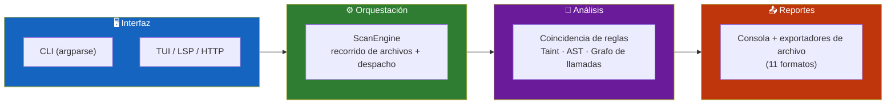
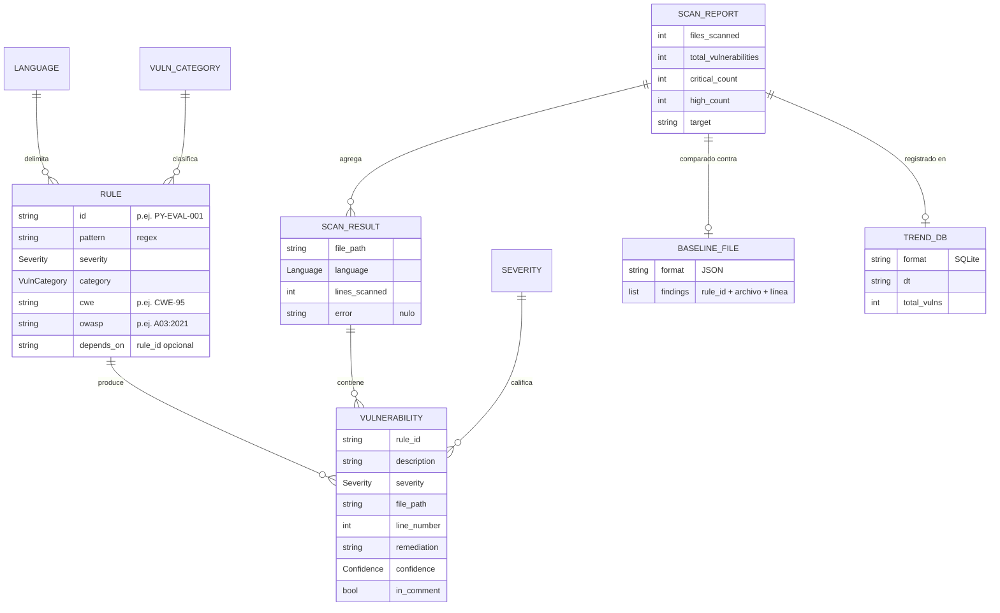
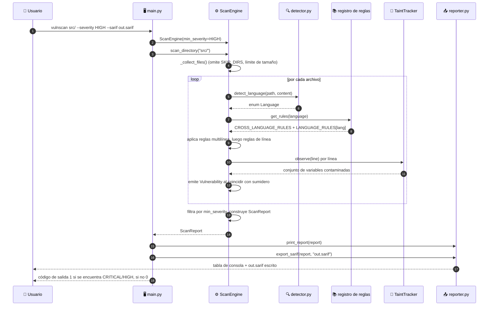
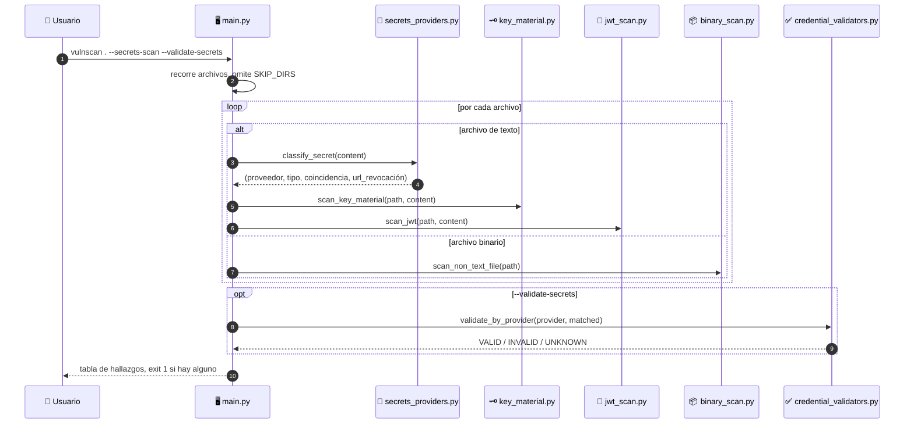
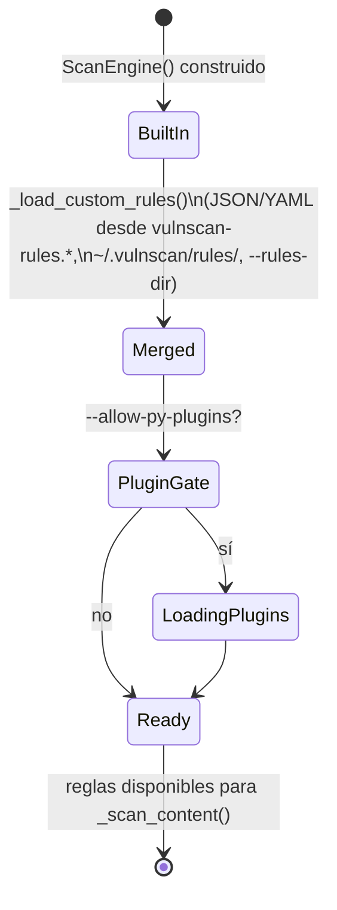
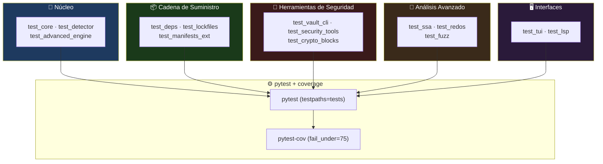

<div align="center">

**🌐 Choose Language / Selecione o Idioma / Elija el Idioma**

[](README.md)&nbsp;&nbsp;&nbsp;[](README_PT.md)&nbsp;&nbsp;&nbsp;[](README_ES.md)

</div>

---

<div align="center">

```
██╗   ██╗██╗   ██╗██╗     ███╗   ██╗███████╗ ██████╗ █████╗ ███╗   ██╗
██║   ██║██║   ██║██║     ████╗  ██║██╔════╝██╔════╝██╔══██╗████╗  ██║
██║   ██║██║   ██║██║     ██╔██╗ ██║███████╗██║     ███████║██╔██╗ ██║
╚██╗ ██╔╝██║   ██║██║     ██║╚██╗██║╚════██║██║     ██╔══██║██║╚██╗██║
 ╚████╔╝ ╚██████╔╝███████╗██║ ╚████║███████║╚██████╗██║  ██║██║ ╚████║
  ╚═══╝   ╚═════╝ ╚══════╝╚═╝  ╚═══╝╚══════╝ ╚═════╝ ╚═╝  ╚═╝╚═╝  ╚═══╝
        Análisis estático multi-lenguaje de vulnerabilidades, secretos y cadena de suministro
```

---

[](https://www.python.org/)
[](https://github.com/Textualize/rich)
[]()
[]()
[]()
[](.github/workflows/ci.yml)

<br/>

> **Un CLI de Python con una sola dependencia que convierte una carpeta de código fuente en una**
> lista priorizada de vulnerabilidades, secretos filtrados, dependencias vulnerables y hallazgos SARIF.

<br/>


</div>

---

## 📑 Tabla de Contenidos

<details>
<summary>▶️ <strong>Haga clic para expandir / contraer esta sección</strong></summary>

<table>
<tr>
<td valign="top" width="50%">

**🏗️ Sistema**
- [Visión General](#-visión-general)
- [Arquitectura del Sistema](#-arquitectura-del-sistema)
- [Stack Tecnológico](#-stack-tecnológico)
- [Patrones de Diseño](#-patrones-de-diseño-aplicados)
- [Estructura del Proyecto](#-estructura-del-proyecto)

**📦 Módulos**
- [ScanEngine — Orquestador Central](#-scanengine--orquestador-central)
- [Registro de Reglas](#-registro-de-reglas)
- [Detector — Identificación de Lenguaje](#-detector-reporter-y-taint-tracker)
- [Reporter — Formatos de Salida](#-detector-reporter-y-taint-tracker)
- [Motor de Complejidad y AST](#-complejidad--motor-ast)
- [Módulos de Secretos y Entropía](#-módulos-de-secretos-y-entropía)
- [Módulos de Dependencias / Cadena de Suministro](#-módulos-de-dependencias--cadena-de-suministro)
- [Vault (almacén de secretos AES-256)](#-vault-tui-lsp-y-punto-de-entrada-cli)
- [TUI, LSP y Punto de Entrada CLI](#-vault-tui-lsp-y-punto-de-entrada-cli)

</td>
<td valign="top" width="50%">

**💼 Negocio**
- [Reglas de Negocio](#-reglas-de-negocio)
- [Requisitos Funcionales](#-requisitos-funcionales)
- [Requisitos No Funcionales](#-requisitos-no-funcionales)

**📐 Diseño**
- [Modelo de Datos](#-modelo-de-datos)
- [Flujos del Sistema](#-flujos-del-sistema)
- [Flujo de Escaneo de Directorio](#flujo-de-escaneo-de-directorio)
- [Flujo de GitHub Action / SARIF](#flujo-de-github-action--sarif)
- [Flujo de Escaneo de Secretos](#flujo-de-escaneo-de-secretos)
- [Máquina de Estados de Carga de Reglas](#máquina-de-estados-de-carga-de-reglas)

**🔐 Seguridad y Operaciones**
- [Seguridad](#-seguridad)
- [Instalación & Ejecución](#-instalación--ejecución)
- [Pruebas Automatizadas](#-pruebas-automatizadas)
- [Métricas & Monitoreo](#-métricas--monitoreo)
- [Limitaciones Conocidas](#-limitaciones-conocidas)

</td>
</tr>
</table>

---

</details>

## 🌟 Visión General

<details>
<summary>▶️ <strong>Haga clic para expandir / contraer esta sección</strong></summary>

**CodeVulnerableAnalyzer** (nombre de CLI `vulnscan`) es una herramienta de análisis estático en Python, empaquetada como `code-vulnerable-analyzer`, que escanea árboles de código fuente en busca de vulnerabilidades de seguridad, problemas de calidad de código, secretos filtrados y dependencias de terceros vulnerables. Se distribuye como un único paquete de Python (`analyzer/`) más un punto de entrada CLI ligero (`main.py`), y depende de exactamente una biblioteca externa en tiempo de ejecución: **Rich**, usada para la interfaz de terminal (barras de progreso, tablas, fragmentos de código resaltados).

El motor funciona aplicando un registro de **912 reglas basadas en patrones** (regex y comparadores multilínea simples definidos como dataclasses `Rule`) en **145 lenguajes reconocidos**, desde lenguajes convencionales (Python, JavaScript, Java, Go, C#) hasta infraestructura como código (Terraform, CloudFormation, manifiestos de Kubernetes, workflows de GitHub Actions), lenguajes de contratos inteligentes (Solidity, Vyper, Move, Cairo) y lenguajes empresariales heredados (COBOL, ABAP, RPG). Más allá de las reglas regex, el código añade un **rastreador de taint** intra-archivo (`analyzer/taint.py`) que sigue variables desde la entrada del usuario hasta sumideros peligrosos, un **motor AST** de Python (`analyzer/pyast_engine.py`) para análisis de CFG/dataflow, y un constructor de **grafo de llamadas** (`analyzer/callgraph.py`) para taint interprocedimental entre archivos.

Más allá del escáner de vulnerabilidades central, el proyecto incluye herramientas de seguridad adyacentes bajo el mismo CLI: un **escáner de secretos** con más de 100 firmas de proveedores, detección de PII para documentos brasileños (CPF/CNPJ), un **vault cifrado AES-256**, **generación de SBOM** (CycloneDX/SPDX), **escaneo de dependencias basado en CVE**, una **GitHub Action** (`action.yml`) que sube SARIF a GitHub Code Scanning, y un **Dockerfile** para ejecución en contenedores.

### 🎯 Objetivos del Sistema

| Objetivo | Descripción |
|-----------|-------------|
| 🛡️ **Detección de Vulnerabilidades** | Aplicar 912 reglas en 145 lenguajes para detectar SQLi, XSS, inyección de comandos, deserialización insegura y más |
| 🔍 **Análisis de Taint** | Rastrear datos controlados por el usuario desde la fuente hasta el sumidero, intra-archivo y (con `--call-graph`) entre archivos |
| 🔑 **Detección de Secretos** | Encontrar credenciales embebidas mediante más de 100 firmas de proveedores, entropía de Shannon, JWT e inspección de claves PEM/DER |
| 📦 **Escaneo de Cadena de Suministro** | Detectar dependencias vulnerables (CVE) en requirements.txt, package.json, pom.xml, Cargo.toml, go.mod y más |
| 📄 **Reportes Multi-Formato** | Exportar JSON, HTML, SARIF, CSV, JUnit XML, Markdown, PDF, DOCX, XLSX, GitLab SAST y HTML interactivo |
| 🔐 **Almacenamiento de Secretos** | Proveer un vault cifrado AES-256 (`--vault`) con acceso vía CLI y REST |
| 🤖 **Integración CI/CD** | Distribuir una GitHub Action compuesta que escanea, publica SARIF y bloquea el build según severidad |
| 🧭 **Ergonomía para Desarrolladores** | Ofrecer una TUI (`--interactive`), un instalador de hook de pre-commit de git, un servidor LSP y un modo de vigilancia |

---

</details>

## 🏗️ Arquitectura del Sistema

<details>
<summary>▶️ <strong>Haga clic para expandir / contraer esta sección</strong></summary>

### Diagrama de Módulos

```mermaid
flowchart TB
    subgraph CLI["🖥️  PUNTO DE ENTRADA"]
        MAIN["main.py\nargparse · 40+ flags\ndespacho de modo"]
    end

    subgraph CORE["⚙️  MOTOR CENTRAL — analyzer/"]
        direction TB
        ENGINE["ScanEngine (engine.py)\nscan_file / scan_directory"]
        DETECT["detect_language (detector.py)\n145 lenguajes"]
        RULES["get_rules() (rules/__init__.py)\n912 reglas · 81 archivos"]
        TAINT["TaintTracker (taint.py)"]
        AST["analyze_python_ast (pyast_engine.py)\n--ast-analysis"]
        CG["build_call_graph (callgraph.py)\n--call-graph"]
    end

    subgraph EXT["🧩  ESCANEOS EXTENDIDOS"]
        direction LR
        SECRETS["secrets_providers · key_material\njwt_scan · binary_scan · entropy · pii"]
        DEPS["deps · sbom · manifests_ext\nlockfiles · dep_health · hash_pinning"]
        VAULT["vault_cli.py — AES-256 + REST"]
        IAC["iac / iac_render\nreglas terraform/docker/k8s/gha"]
    end

    subgraph OUT["📤  REPORTES"]
        FILES["reporter.py + reporting_ext.py\nJSON·HTML·SARIF·CSV·JUnit·MD·PDF·DOCX·XLSX·GitLab·badge"]
    end

    subgraph ITF["🌐  INTERFACES"]
        direction LR
        TUI["tui.py / lsp.py"]
        SERVER["--serve HTTP API"]
        HOOK["--install-hook"]
    end

    MAIN --> ENGINE
    ENGINE --> DETECT
    ENGINE --> RULES
    ENGINE --> TAINT
    ENGINE -.-> AST
    ENGINE -.-> CG
    MAIN --> SECRETS & DEPS & VAULT & IAC
    ENGINE --> FILES
    MAIN --> TUI & SERVER & HOOK

    style CLI fill:#1e3a5f,color:#fff,stroke:#4a90d9
    style CORE fill:#1a3a1a,color:#fff,stroke:#4caf50
    style EXT fill:#3a1a1a,color:#fff,stroke:#e57373
    style OUT fill:#3a2a1a,color:#fff,stroke:#ffb74d
    style ITF fill:#2a1a3a,color:#fff,stroke:#ce93d8
```



### Capas de Arquitectura



---

</details>

## 🛠️ Stack Tecnológico

<details>
<summary>▶️ <strong>Haga clic para expandir / contraer esta sección</strong></summary>

<table>
<thead>
<tr>
<th>Capa</th>
<th>Tecnología</th>
<th>Versión</th>
<th>Propósito</th>
</tr>
</thead>
<tbody>
<tr>
<td rowspan="2"><strong>🧠 Lenguaje / Runtime</strong></td>
<td>Python</td>
<td>&gt;= 3.10 (Docker: 3.13-slim)</td>
<td>Único lenguaje de implementación (<code>requires-python</code> en <code>pyproject.toml</code>)</td>
</tr>
<tr>
<td>CPython stdlib</td>
<td>—</td>
<td><code>argparse</code>, <code>re</code>, <code>ast</code>, <code>http.server</code>, <code>tomllib</code>, <code>importlib</code></td>
</tr>
<tr>
<td rowspan="1"><strong>📦 Dependencia de Runtime</strong></td>
<td>Rich</td>
<td>&gt;=13.7.0,&lt;14.0.0</td>
<td>Interfaz de terminal: <code>Console</code>, <code>Table</code>, <code>Progress</code>, <code>Panel</code>, <code>Syntax</code> — la única dependencia de producción</td>
</tr>
<tr>
<td rowspan="4"><strong>🧪 Desarrollo / Calidad</strong></td>
<td>ruff</td>
<td>&gt;=0.6</td>
<td>Puerta de lint: conjuntos de reglas <code>F</code>, <code>I</code>, <code>UP</code>, <code>E</code>/<code>W</code>, <code>B</code> (aplicado en CI)</td>
</tr>
<tr>
<td>mypy</td>
<td>&gt;=1.11</td>
<td>Tipado gradual (<code>check_untyped_defs = false</code>)</td>
</tr>
<tr>
<td>pytest</td>
<td>&gt;=8</td>
<td>Ejecutor de pruebas (<code>testpaths = ["tests"]</code>)</td>
</tr>
<tr>
<td>pytest-cov</td>
<td>&gt;=5</td>
<td>Medición de cobertura, piso 75% (<code>fail_under</code>)</td>
</tr>
<tr>
<td rowspan="2"><strong>📦 Empaquetado</strong></td>
<td>setuptools</td>
<td>&gt;=70</td>
<td>Backend de build (<code>setuptools.build_meta</code>)</td>
</tr>
<tr>
<td>Nombre en PyPI</td>
<td>code-vulnerable-analyzer</td>
<td>Punto de entrada de consola <code>vulnscan = "main:main"</code></td>
</tr>
<tr>
<td rowspan="2"><strong>🐳 Contenedor</strong></td>
<td>Imagen base Docker</td>
<td>python:3.13-slim</td>
<td><code>Dockerfile</code> — usuario no root <code>vulnscan</code>, entrypoint <code>python main.py</code></td>
</tr>
<tr>
<td>Entrypoint</td>
<td>—</td>
<td><code>ENTRYPOINT ["python", "main.py"]</code></td>
</tr>
<tr>
<td rowspan="2"><strong>🤖 CI/CD</strong></td>
<td>GitHub Actions</td>
<td>—</td>
<td><code>.github/workflows/ci.yml</code>; el proyecto también se distribuye como una acción compuesta reutilizable (<code>action.yml</code>)</td>
</tr>
<tr>
<td>Subida de SARIF</td>
<td>codeql-action/upload-sarif@v3</td>
<td>Publica hallazgos en GitHub Code Scanning</td>
</tr>
<tr>
<td><strong>📄 Formatos de Exportación</strong></td>
<td>JSON / HTML / SARIF 2.1 / CSV / JUnit XML / Markdown / PDF / DOCX / XLSX / GitLab SAST / HTML interactivo / badge SVG</td>
<td>—</td>
<td>Implementado en <code>reporter.py</code> y <code>reporting_ext.py</code></td>
</tr>
</tbody>
</table>

---

</details>

## 🎨 Patrones de Diseño Aplicados

<details>
<summary>▶️ <strong>Haga clic para expandir / contraer esta sección</strong></summary>

| Patrón | Dónde | Justificación |
|---------|-------|-----------|
| 🗂️ **Registry** | `analyzer/rules/__init__.py` — `LANGUAGE_RULES`, `CROSS_LANGUAGE_RULES` | Cada módulo de reglas se registra en un diccionario central indexado por `Language`, consultado vía `get_rules()` |
| 🧱 **Dataclass Value Object** | `Rule` (`rules/base.py`), `Vulnerability`, `ScanResult`, `ScanReport` (`models.py`) | Registros inmutables por convención que atraviesan todo el pipeline |
| 🎯 **Strategy** | Funciones de exportación (`export_json`, `export_sarif`, `export_html`, …) en `reporter.py` | Cada formato de salida es una función intercambiable que recibe el mismo `ScanReport` |
| 🏭 **Factory (construcción de reglas)** | `_rule_from_entry()` en `engine.py` | Convierte un dict JSON/YAML en un objeto `Rule`, usado para reglas personalizadas `--rules-dir` |
| 🔌 **Plugin** | `_load_py_plugin_rules()` detrás de `--allow-py-plugins` | Carga listas `RULES` de terceros desde módulos `.py`, opt-in explícito para ejecución de código arbitrario |
| 👂 **Observer / Callback** | `ScanEngine(on_file_start=..., on_file_done=...)` | El `ScanTracker` de `main.py` actualiza la barra `Progress` de Rich a medida que se escanean archivos |
| 🧭 **Facade** | `ScanEngine.scan_directory()` / `scan_files()` | Oculta la recolección de archivos, detección de lenguaje, coincidencia de reglas y análisis de taint detrás de dos métodos |
| 🚦 **Guard Clause / Salida Temprana** | Límite de tamaño de archivo, filtro `min_severity`, exclusión `SKIP_DIRS` en `engine.py` y `detector.py` | Comprobaciones baratas cortocircuitan la costosa coincidencia de reglas |
| 🔁 **Template Method (despacho por lenguaje)** | `_LANG_MAP` en `main.py`, `EXTENSION_MAP` en `detector.py` | Un único pipeline de escaneo ramifica su conjunto de reglas según el `Language` enum detectado |
| 🧮 **Incremental / Memoización** | `IncrementalCache` (`incremental.py`) usado con `--incremental` | Omite reescanear archivos cuyo hash de contenido no cambió |

---

</details>

## 📁 Estructura del Proyecto

<details>
<summary>▶️ <strong>Haga clic para expandir / contraer esta sección</strong></summary>

```
CodeVulnerableAnalyzer/
│
├── 📄 main.py                       # Punto de entrada CLI — argparse, despacho de modo, 40+ flags
├── 📄 pyproject.toml                # Metadatos del paquete, configuración ruff/mypy/pytest/coverage
├── 📄 requirements.txt              # Única dependencia de runtime: rich>=13.7.0,<14.0.0
├── 📄 MANIFEST.in                   # Reglas de inclusión de archivos para la distribución fuente
├── 📄 pytest.ini                    # Configuración de pytest
├── 📄 action.yml                    # GitHub composite Action — escaneo + subida de SARIF
├── 📄 Dockerfile                    # python:3.13-slim, usuario no root, ENTRYPOINT main.py
├── 📄 vulnscan.bat                  # Lanzador para Windows (wrapper chcp utf8)
├── 📄 vulnscan.sh                   # Lanzador POSIX
│
├── 📂 analyzer/                     # ★ Paquete central (141 archivos .py)
│   ├── 📄 __init__.py, models.py    # __version__; Severity, Confidence, Language (145), VulnCategory
│   ├── 📄 engine.py, detector.py    # Bucle de aplicación de reglas de ScanEngine; detección de lenguaje + SKIP_DIRS
│   ├── 📄 taint.py, callgraph.py    # Rastreo de taint intra-archivo; grafo de llamadas interprocedimental (--call-graph)
│   ├── 📄 pyast_engine.py           # Análisis AST de Python (CFG, dataflow, código muerto, TOCTOU)
│   ├── 📄 complexity.py             # Hallazgos de complejidad ciclomática / mantenibilidad
│   ├── 📄 reporter.py, reporting_ext.py  # Consola + JSON/HTML/SARIF/CSV/JUnit/MD/PDF/DOCX/XLSX/GitLab
│   ├── 📄 baseline.py, incremental.py    # --diff/--save-baseline; caché por hash de contenido para --incremental
│   ├── 📄 entropy.py, pii.py             # Secretos por entropía de Shannon; CPF/CNPJ/tarjeta/correo/teléfono
│   ├── 📄 secrets_providers.py, key_material.py, jwt_scan.py, binary_scan.py  # Escaneo de secretos/JWT/clave/binario
│   ├── 📄 credential_validators.py, secret_history.py, secrets_baseline.py    # Validación, historial git, baseline
│   ├── 📄 vault_cli.py              # CLI + REST del vault AES-256
│   ├── 📄 deps.py, manifests_ext.py, lockfiles.py   # Escaneo CVE, ecosistemas extendidos, árbol de dependencias
│   ├── 📄 dep_health.py, dep_autofix.py, hash_pinning.py  # Chequeos de typosquat/licencia/abandono, planes de bump
│   ├── 📄 sbom.py, sbom_ext.py, vex.py   # SBOM CycloneDX/SPDX, supresión CVE vía VEX
│   ├── 📄 mobile_archive.py, iac.py, iac_render.py  # Inspección de APK/IPA; renderizado de IaC
│   ├── 📄 tui.py, lsp.py, trend.py       # TUI interactiva; servidor LSP; historial SQLite + gráfico de tendencia
│   ├── 📄 remediation.py, ai_triage.py   # Codemods de autofix determinísticos; explicaciones en modo educativo
│   ├── 📄 i18n.py, theme.py, compliance.py  # locale pt/en; temas de terminal; mapeo de cumplimiento
│   └── 📂 rules/                    # ★ 912 reglas en 81 archivos
│       ├── 📄 base.py, __init__.py  # Dataclass Rule; registro LANGUAGE_RULES, get_rules(), rule_count()
│       ├── 📄 python_rules.py, javascript_rules.py, sql_rules.py  # Reglas de lenguajes convencionales
│       ├── 📄 terraform_rules.py, docker_rules.py, k8s_rules.py, gha_rules.py  # IaC
│       ├── 📄 solidity_rules.py, vyper_rules.py, move_rules.py, cairo_rules.py # Contratos inteligentes
│       ├── 📄 quality_*.py, solid_rules.py, architecture_rules.py              # Calidad de código / SOLID
│       └── 📄 … (71 archivos más de reglas por lenguaje / dominio)
│
├── 📂 tests/                        # 25 archivos de prueba (pytest)
│   ├── 📄 test_core.py, test_detector.py, test_advanced_engine.py
│   ├── 📄 test_deps.py, test_lockfiles.py, test_manifests_ext.py
│   ├── 📄 test_secrets_and_supplychain.py, test_risk_and_supplychain.py
│   ├── 📄 test_vault_cli.py, test_lsp.py, test_tui.py
│   ├── 📄 test_fuzz.py, test_redos.py, test_ssa.py, test_crypto_blocks.py
│   ├── 📄 test_platform_expansion.py, test_module_coverage.py
│   ├── 📂 benchmark/                # corpus.py + __init__.py — benchmarks de rendimiento
│   └── 📂 samples/vulnerable_app.py # Fixture de aplicación intencionalmente vulnerable
│
├── 📂 docs/                         # ACCESSIBILITY, AI_TRIAGE, AUTOFIX, COVERAGE_LIMITS, EDUCATION, PERFORMANCE, TUTORIAL
├── 📂 scripts/                      # plantilla de hook pre-commit + scripts auxiliares
├── 📂 benchmarks/                   # Arnés de benchmarking independiente
├── 📂 integrations/                 # Adaptadores de integración de terceros
├── 📂 desktop/, web/, mobile-companion/, vscode-ext/  # Clientes complementarios (fuera del alcance de este README)
├── 📂 packaging/                    # Recursos de empaquetado de distribución
├── 📂 .github/workflows/ci.yml      # CI: lint (ruff), verificación de tipos (mypy), pruebas (pytest + coverage)
│
├── 📄 README.md                     # 🇺🇸 Inglés (primario)
├── 📄 README_PT.md                  # 🇧🇷 Português
└── 📄 README_ES.md                  # 🇪🇸 Español
```

---

</details>

## 📦 Módulos del Sistema

<details>
<summary>▶️ <strong>Haga clic para expandir / contraer esta sección</strong></summary>

### 🎛️ ScanEngine — Orquestador Central

`analyzer/engine.py` define `ScanEngine`, la clase que todo modo de escaneo termina invocando. Gestiona la recolección de archivos, la aplicación de reglas, el análisis de taint, la caché incremental y el filtrado por severidad.

| Responsabilidad | Implementación |
|-----------------|----------------|
| Descubrimiento de archivos | `_collect_files()` — `Path.rglob("*")` filtrado por `is_scannable()` y `SKIP_DIRS` |
| Aplicación de reglas | `_scan_content()` — itera reglas `Rule` de una línea y multilínea, respeta el encadenamiento `depends_on` |
| Análisis de taint | `_analyze_taint()` — `TaintTracker.observe()` por línea más la tabla regex `TAINT_SINKS` |
| Reglas personalizadas | `_load_custom_rules()` — combina `vulnscan-rules.json/yaml`, `~/.vulnscan/rules/`, `--rules-dir`, `VULNSCAN_RULES_DIR` |
| Archivo de configuración | `_load_config()` — lee `vulnscan.toml` / `vulnscan.json` para `severity_overrides` y `suppress` |
| Supresión | `# vulnscan: ignore RULE_ID` en línea, archivo `.vulnscan-ignore`, y lista `suppress` a nivel de configuración |
| Escaneo incremental | `IncrementalCache` (opt-in vía `--incremental`) — omite contenido de archivo sin cambios |

---

### 📚 Registro de Reglas

`analyzer/rules/__init__.py` agrega cada módulo de reglas en `LANGUAGE_RULES: dict[Language, list[Rule]]` y `CROSS_LANGUAGE_RULES` (reglas genéricas, de calidad, SOLID y de arquitectura que aplican sin importar el lenguaje).

| Función | Propósito |
|----------|---------|
| `get_rules(language)` | Devuelve `CROSS_LANGUAGE_RULES + LANGUAGE_RULES[language]` para un escaneo |
| `get_all_rules()` | Lista plana deduplicada de las 912 reglas, usada por `--rules` |
| `rule_count()` | `len(get_all_rules())` — impreso en el banner de inicio |
| `Rule` (`rules/base.py`) | Dataclass: `id`, `name`, `pattern` (regex), `severity`, `category`, `language`, `cwe`, `owasp`, `confidence`, `negative_pattern`, `multiline`, `depends_on` |

Cada archivo de reglas (p. ej. `python_rules.py`, `terraform_rules.py`, `solidity_rules.py`) exporta una constante `list[Rule]` a nivel de módulo que el registro importa y combina.

---

### 🔍 Detector, Reporter y Taint Tracker

`analyzer/detector.py` mapea rutas de archivo a un enum `Language` vía `EXTENSION_MAP` con respaldo por línea shebang, más `is_scannable()` y el conjunto de exclusión `SKIP_DIRS` (`.git`, `node_modules`, `__pycache__`, `build`, …). `analyzer/reporter.py` renderiza resultados en la terminal y exporta `JSON`/`HTML`/`SARIF 2.1`/`CSV`/`JUnit`/`Markdown`/badges SVG; `analyzer/reporting_ext.py` añade `PDF`/`DOCX`/`XLSX`/GitLab SAST/HTML interactivo. `analyzer/taint.py` implementa `TaintTracker`, observando cada línea en busca de fuentes de taint (`request.args`, `input()`, `os.environ`) y propagando el taint a través de asignaciones, marcando `TAINT-001` cuando una variable contaminada llega a una entrada de `TAINT_SINKS` (`execute(`, `os.system(`) sin sanitización aparente.

| Función | Formato / Rol |
|----------|--------|
| `export_json` / `export_html` / `export_sarif` | JSON, HTML estático, SARIF 2.1 (GitHub Code Scanning, VS Code) |
| `export_csv` / `export_junit` / `export_markdown` / `export_badge` | Hoja de cálculo, reporte de pruebas para CI, documentación, badge SVG |
| `export_pdf` / `export_docx` / `export_xlsx` (reporting_ext) | Documentos de reporte técnico |
| `gitlab_sast` / `interactive_html` (reporting_ext) | JSON GitLab SAST, HTML interactivo autocontenido |

---

### 🧮 Complejidad & Motor AST

`analyzer/complexity.py` calcula hallazgos de complejidad ciclomática añadidos a cada resultado de escaneo. `analyzer/pyast_engine.py` (`--ast-analysis`) realiza un análisis AST real para Python: construcción de CFG, dataflow, detección de código muerto, recursión sin caso base, condiciones de carrera TOCTOU y patrones de uso tras cierre/desreferencia nula, capacidades que las reglas regex simples no pueden expresar. `analyzer/callgraph.py` (`--call-graph`) construye un grafo de llamadas interprocedimental y ejecuta análisis de taint entre archivos sobre él.

---

### 🔑 Módulos de Secretos y Entropía

| Módulo | Rol |
|--------|------|
| `secrets_providers.py` / `entropy.py` / `pii.py` | Más de 100 firmas de proveedores (`--secrets-scan`); detección por entropía de Shannon (`--entropy`); CPF/CNPJ/tarjeta/correo/teléfono (`--pii`) |
| `key_material.py` / `jwt_scan.py` / `binary_scan.py` | Detección de claves privadas PEM/DER; debilidades estructurales de JWT; secretos dentro de binarios/EXIF/PDF/`.env` |
| `credential_validators.py` / `secret_history.py` / `secrets_baseline.py` | Validación de credenciales en vivo (`--validate-secrets`); escaneo de historial/parches git; supresión mediante baseline |

---

### 📦 Módulos de Dependencias / Cadena de Suministro

| Módulo | Rol |
|--------|------|
| `deps.py` | `scan_manifest_dir()` — búsqueda de CVE para requirements.txt, package.json, pom.xml, Cargo.toml, go.mod, .csproj; `scan_manifest_dir_osv()` cruza con OSV.dev |
| `manifests_ext.py` / `lockfiles.py` | Ecosistemas extendidos (Composer, Gemfile, NuGet, pubspec, SwiftPM, CocoaPods, …); árbol de dependencias transitivas (`--dep-tree`) |
| `dep_health.py` / `dep_autofix.py` / `hash_pinning.py` | Chequeos de typosquat/licencia/abandono; `build_bump_plan()` genera diffs de actualización; integridad de hash/pinning de lockfiles |
| `sbom.py` / `sbom_ext.py` / `vex.py` | Generación de SBOM CycloneDX/SPDX; supresión de CVE mediante documento VEX |

---

### 🔐 Vault, TUI, LSP y Punto de Entrada CLI

`analyzer/vault_cli.py` implementa un almacén de secretos local cifrado con AES-256, accesible mediante `--vault FILE` más `--vault-init/-set/-get/-list/-delete/-passwd`, y un servidor REST opcional (`--vault-serve PORT`).

| Módulo | Rol |
|--------|------|
| `main.py` | CLI basado en argparse, despacho de modo (scan / stdin / server / vault / call-graph / trend / rules / langs) |
| `tui.py` / `lsp.py` | Interfaz de terminal interactiva de pantalla completa (`--interactive`); servidor LSP sobre stdio para editores (`--lsp`) |
| `trend.py` | `TrendDB` — historial de escaneos respaldado por SQLite con gráfico de tendencia ASCII (`--trend`) |

---

</details>

## 💼 Reglas de Negocio

<details>
<summary>▶️ <strong>Haga clic para expandir / contraer esta sección</strong></summary>

### 🔎 Reglas de Escaneo

| # | Regla | Cumplimiento |
|---|------|-------------|
| RN-01 | Los archivos mayores de 5 MB se omiten, no se escanean | Verificación `MAX_FILE_SIZE_MB = 5` en `ScanEngine.scan_file` |
| RN-02 | Las líneas de más de 2000 caracteres se omiten en la coincidencia de patrones | `MAX_LINE_LENGTH = 2000` en `engine.py` |
| RN-03 | Los directorios en `SKIP_DIRS` (p. ej. `.git`, `node_modules`, `build`) nunca se recorren | Filtro de `_collect_files()` |
| RN-04 | Un hallazgo se dispara como máximo una vez por `(rule_id, file_path, line_number)` | Clave de deduplicación `seen: set[tuple]` en `_scan_content` |
| RN-05 | Las reglas con `depends_on` solo se evalúan después de que su regla dependiente ya se haya disparado en ese archivo | Barrera `fired: set[str]` en `_scan_content` |
| RN-06 | Los hallazgos dentro de comentarios reducen su confianza, no se descartan, salvo que se establezca `--no-comments` | Seguimiento de bloques de comentario + lógica de reducción de `Confidence` |

### 🎚️ Reglas de Severidad y Supresión

| # | Regla | Cumplimiento |
|---|------|-------------|
| RN-07 | Solo se reportan hallazgos en o por encima de `--severity` (por defecto `INFO`) | Filtro `severity.value >= self.min_severity.value` |
| RN-08 | `# vulnscan: ignore RULE_ID` en línea suprime ese hallazgo en esa línea | Coincidencia regex de `_is_inline_suppressed()` |
| RN-09 | Un archivo `.vulnscan-ignore` en la raíz del escaneo suprime `RULE_ID` o `FILE:RULE_ID` globalmente | `_load_ignore_file()` |
| RN-10 | `severity_overrides` de `vulnscan.toml`/`vulnscan.json` reemplaza la severidad por defecto de una regla | `_severity_overrides_from_config()` |
| RN-11 | El código de salida es `1` cuando el reporte contiene cualquier hallazgo CRITICAL o HIGH, si no `0` | `return 1 if (...) else 0` final en `main()` |

### 🔑 Reglas de Secretos y Vault

| # | Regla | Cumplimiento |
|---|------|-------------|
| RN-12 | `--validate-secrets` solo se ejecuta cuando `--secrets-scan` también está activo y requiere acceso a red | `args.validate_secrets` verificado dentro de la rama `secrets_scan` |
| RN-13 | `--allow-py-plugins` es requerido antes de ejecutar cualquier plugin de regla `.py` | Flag de opt-in explícito que controla `_load_py_plugin_rules()` |
| RN-14 | La GitHub Action falla el build cuando se encuentra un hallazgo de severidad `fail-on` (por defecto `HIGH`) | `action.yml` — cuenta CRITICAL/HIGH desde SARIF, `exit 1` |

---

</details>

## ✅ Requisitos Funcionales

<details>
<summary>▶️ <strong>Haga clic para expandir / contraer esta sección</strong></summary>

| ID | Requisito | Prioridad | Estado |
|----|-------------|----------|--------|
| **RF-01** | El sistema debe escanear un solo archivo o un árbol de directorios completo en busca de vulnerabilidades | 🔴 Alta | ✅ Implementado |
| **RF-02** | El sistema debe detectar el lenguaje de un archivo por su extensión o shebang | 🔴 Alta | ✅ Implementado |
| **RF-03** | El sistema debe aplicar reglas específicas de lenguaje y transversales a los archivos coincidentes | 🔴 Alta | ✅ Implementado |
| **RF-04** | El sistema debe rastrear datos contaminados desde la fuente hasta el sumidero dentro de un archivo | 🔴 Alta | ✅ Implementado |
| **RF-05** | El sistema debe poder construir opcionalmente un grafo de llamadas y rastrear taint entre archivos (`--call-graph`) | 🟡 Media | ✅ Implementado |
| **RF-06** | El sistema debe filtrar hallazgos por severidad mínima vía `--severity` | 🔴 Alta | ✅ Implementado |
| **RF-07** | El sistema debe filtrar hallazgos por lenguaje vía `--lang` | 🟡 Media | ✅ Implementado |
| **RF-08** | El sistema debe exportar hallazgos como JSON, HTML, SARIF, CSV, JUnit XML y Markdown | 🔴 Alta | ✅ Implementado |
| **RF-09** | El sistema debe exportar hallazgos como PDF, DOCX, XLSX y JSON GitLab SAST | 🟡 Media | ✅ Implementado |
| **RF-10** | El sistema debe generar un badge SVG que resuma el conteo de hallazgos | 🟢 Baja | ✅ Implementado |
| **RF-11** | El sistema debe comparar un escaneo contra una línea base JSON guardada (`--diff`) | 🟡 Media | ✅ Implementado |
| **RF-12** | El sistema debe escanear en busca de secretos embebidos en más de 100 firmas de proveedores | 🔴 Alta | ✅ Implementado |
| **RF-13** | El sistema debe detectar secretos por entropía de Shannon independientemente de firmas de proveedor | 🟡 Media | ✅ Implementado |
| **RF-14** | El sistema debe detectar PII brasileña (CPF, CNPJ, teléfono) y números de tarjeta de crédito | 🟡 Media | ✅ Implementado |
| **RF-15** | El sistema debe escanear manifiestos de dependencias en busca de CVE conocidos | 🔴 Alta | ✅ Implementado |
| **RF-16** | El sistema debe poder cruzar opcionalmente dependencias con OSV.dev (`--osv`) | 🟡 Media | ✅ Implementado |
| **RF-17** | El sistema debe generar un SBOM CycloneDX o SPDX | 🟡 Media | ✅ Implementado |
| **RF-18** | El sistema debe proveer un vault local cifrado AES-256 para secretos | 🟡 Media | ✅ Implementado |
| **RF-19** | El sistema debe proveer una TUI interactiva para explorar hallazgos | 🟡 Media | ✅ Implementado |
| **RF-20** | El sistema debe proveer un servidor LSP para integración con editores | 🟢 Baja | ✅ Implementado |
| **RF-21** | El sistema debe proveer un instalador de hook de pre-commit de git | 🟡 Media | ✅ Implementado |
| **RF-22** | El sistema debe soportar reescaneo continuo en modo vigilancia | 🟢 Baja | ✅ Implementado |
| **RF-23** | El sistema debe exponer una API HTTP (`--serve PORT`) para integración con CI | 🟡 Media | ✅ Implementado |
| **RF-24** | El sistema debe soportar lectura de código fuente desde stdin para escaneos de un solo fragmento | 🟢 Baja | ✅ Implementado |
| **RF-25** | El sistema debe generar un diff de autofix determinístico para un subconjunto de hallazgos | 🟢 Baja | ⚠️ Parcial |
| **RF-26** | El sistema debe distribuir una GitHub Action que suba SARIF a Code Scanning | 🔴 Alta | ✅ Implementado |

---

</details>

## ⚡ Requisitos No Funcionales

<details>
<summary>▶️ <strong>Haga clic para expandir / contraer esta sección</strong></summary>

| ID | Categoría | Requisito | Objetivo |
|----|----------|-------------|--------|
| **RNF-01** | ⚡ Rendimiento | Los archivos por encima de 5 MB se omiten en lugar de degradar el tiempo de escaneo | Límite fijo, `MAX_FILE_SIZE_MB = 5` |
| **RNF-02** | ⚡ Rendimiento | Las líneas por encima de 2000 caracteres se omiten en la coincidencia regex | Límite fijo, `MAX_LINE_LENGTH = 2000` |
| **RNF-03** | ⚡ Rendimiento | Los escaneos repetidos de archivos sin cambios reutilizan resultados en caché | Caché por hash de contenido `--incremental` |
| **RNF-04** | 📦 Huella | Exactamente una dependencia de terceros en tiempo de ejecución | `rich>=13.7.0,<14.0.0` en `requirements.txt` |
| **RNF-05** | 🔧 Compatibilidad | Compatible con Python 3.10 y superiores | `requires-python = ">=3.10"` |
| **RNF-06** | 🔧 Compatibilidad | Se ejecuta de forma idéntica en Windows, macOS y Linux | Reconfiguración de consola UTF-8 para `win32` en `main.py` |
| **RNF-07** | 🧪 Puerta de Calidad | El lint pasa al 100% en el conjunto de reglas ruff aplicado | `select = ["F","I","UP","E","W","B"]`, bloqueante en CI |
| **RNF-08** | 🧪 Puerta de Calidad | La cobertura de pruebas nunca retrocede por debajo del piso escalonado | `fail_under = 75` en `pyproject.toml` |
| **RNF-09** | 🔐 Seguridad | Los secretos del vault se cifran en reposo con AES-256 | `vault_cli.py` |
| **RNF-10** | 🔐 Seguridad | La ejecución de plugins Python arbitrarios requiere opt-in explícito | Flag `--allow-py-plugins` |
| **RNF-11** | 🔐 Seguridad | La validación activa de credenciales contra APIs de proveedores requiere opt-in explícito | Flag `--validate-secrets`, uso de red documentado |
| **RNF-12** | 🌍 Internacionalización | Las etiquetas de la interfaz y el texto de reglas pueden alternarse entre portugués e inglés | `--locale {pt,en}`, `analyzer/i18n.py` |
| **RNF-13** | ♿ Usabilidad | La salida de terminal se adapta a temas oscuro, claro y de alto contraste | `--theme {dark,light,high-contrast}`, `analyzer/theme.py` |
| **RNF-14** | 🧱 Mantenibilidad | Cada módulo de reglas expone una única constante plana `list[Rule]` | Contrato consistente en los 81 archivos de reglas |
| **RNF-15** | 🤖 CI/CD | La GitHub Action debe ejecutarse sin configuración adicional más allá de `path` | Valores por defecto de `action.yml` para cada entrada |
| **RNF-16** | 📈 Observabilidad | Cada escaneo completado se registra en una base de datos de tendencia local | `TrendDB().record(report)` envuelto en un `try/except` de mejor esfuerzo |

---

</details>

## 🗄️ Modelo de Datos

<details>
<summary>▶️ <strong>Haga clic para expandir / contraer esta sección</strong></summary>

CodeVulnerableAnalyzer no tiene base de datos externa. Su "modelo de datos" es el conjunto de dataclasses en memoria definidas en `analyzer/models.py` que fluyen desde un archivo escaneado hasta un reporte, más los formatos en disco (línea base JSON, base de datos de tendencia SQLite, archivo de vault cifrado) que persisten estado entre ejecuciones.

### Diagrama Entidad-Relación



### Especificación del Registro de Reglas

| Campo | Tipo | Notas |
|-------|------|-------|
| `id` | `str` | Identificador estable de regla, p. ej. `PY-EVAL-001`, `TAINT-001` |
| `pattern` | `str` (regex) | Compilado una vez por `Rule`; `negative_pattern` opcionalmente excluye coincidencias |
| `severity` | enum `Severity` | `CRITICAL(5)` .. `INFO(1)`, sobrescribible por regla vía configuración |
| `category` | enum `VulnCategory` | ~60 categorías desde `SQL_INJECTION` hasta `IAC_SECURITY` |
| `cwe` / `owasp` | `str \| None` | Identificador CWE y categoría OWASP Top 10, cuando aplica |
| `depends_on` | `str \| None` | `id` de otra regla que debe haberse disparado ya en el mismo archivo |

### Formatos Persistidos

| Almacén | Formato | Escrito por |
|-------|--------|-----------|
| Línea base | JSON | `analyzer/baseline.py` (`--save-baseline`) |
| Historial de tendencia de escaneo | SQLite | `analyzer/trend.py` (`TrendDB`, automático por escaneo) |
| Línea base de secretos | JSON | `analyzer/secrets_baseline.py` (`--save-secrets-baseline`) |
| Vault | Binario cifrado AES-256 | `analyzer/vault_cli.py` (`--vault-init`) |
| Reglas personalizadas | JSON / YAML | `vulnscan-rules.json`, `vulnscan-rules.yaml`, `~/.vulnscan/rules/*` |
| Configuración | TOML / JSON | `vulnscan.toml` / `vulnscan.json` (`severity_overrides`, `suppress`) |

---

</details>

## 🔄 Flujos del Sistema

<details>
<summary>▶️ <strong>Haga clic para expandir / contraer esta sección</strong></summary>

### Flujo de Escaneo de Directorio



### Flujo de GitHub Action / SARIF

```mermaid
flowchart TD
    START([Workflow dispara action.yml]) --> SETUP[actions/setup-python@v5]
    SETUP --> INSTALL[pip install rich]
    INSTALL --> RUN["python main.py PATH\n--severity min-severity\n--sarif sarif-output --quiet"]
    RUN --> PARSE[Analiza SARIF: cuenta total/CRITICAL/HIGH]
    PARSE --> SUMMARY[Escribe tabla en GITHUB_STEP_SUMMARY]
    SUMMARY --> UPLOAD{upload-sarif == true?}
    UPLOAD -- Sí --> CODEQL[github/codeql-action/upload-sarif@v3]
    UPLOAD -- No --> GATE
    CODEQL --> GATE{severidad fail-on encontrada?}
    GATE -- Sí --> FAIL([exit 1 — build falla])
    GATE -- No --> PASS([exit 0 — build pasa])

    style START fill:#1565C0,color:#fff
    style PASS fill:#2E7D32,color:#fff
    style FAIL fill:#B71C1C,color:#fff
```

### Flujo de Escaneo de Secretos



### Máquina de Estados de Carga de Reglas



---

</details>

## 🔐 Seguridad

<details>
<summary>▶️ <strong>Haga clic para expandir / contraer esta sección</strong></summary>

### Controles Implementados

| Control | Implementación | Efecto |
|---------|----------------|--------|
| 🔌 **Opt-in explícito de plugins** | `--allow-py-plugins` controla `_load_py_plugin_rules()` | Los módulos de reglas `.py` de terceros nunca se ejecutan salvo que el usuario lo permita explícitamente |
| 🌐 **Opt-in explícito de red** | `--osv`, `--validate-secrets`, `--check-abandoned` son flags de opt-in | La herramienta es completamente offline por defecto; solo estos flags realizan llamadas de red |
| 🔐 **Vault cifrado** | `analyzer/vault_cli.py` — cifrado AES-256 en reposo | Los secretos almacenados localmente no se guardan en texto plano |
| 🧾 **Rastro de auditoría de supresión** | `.vulnscan-ignore`, `# vulnscan: ignore` en línea, `suppress` de configuración | Todo hallazgo suprimido es rastreable a una fuente explícita y revisable |
| 🐳 **Usuario no root en contenedor** | `Dockerfile` — `useradd --system --gid vulnscan` | La imagen Docker nunca ejecuta el escáner como root |
| 📦 **Única dependencia de runtime fijada** | `requirements.txt` — `rich>=13.7.0,<14.0.0` | Superficie de cadena de suministro mínima; `requirements.txt` documenta un comando de verificación de hash |
| 🔍 **Los hallazgos SARIF alimentan GitHub Code Scanning** | `action.yml` — `upload-sarif@v3` | Los hallazgos son visibles en la pestaña de seguridad nativa del repositorio, no solo en los logs de CI |
| ✅ **Fallo de CI condicionado por severidad** | `action.yml` — entrada `fail-on` (por defecto `HIGH`) | Los builds fallan de forma determinística ante hallazgos CRITICAL/HIGH |
| 🪝 **Hook de pre-commit** | `install_hook()` en `main.py` | Bloquea commits locales con hallazgos CRITICAL/HIGH antes de que lleguen al remoto |

### Limitaciones de Seguridad Conocidas

> [!WARNING]
> CodeVulnerableAnalyzer es un analizador estático basado en patrones/regex (más un rastreador de taint ligero y un motor AST de Python). No es una herramienta de verificación formal, y las siguientes limitaciones son inherentes a ese diseño.

| Limitación | Riesgo | Camino de mitigación |
|------------|------|-----------------|
| 🎯 **Coincidencia basada en regex para la mayoría de lenguajes** | Falsos positivos/negativos comparado con un análisis completo basado en AST, especialmente en código ofuscado o construido en múltiples líneas | `--ast-analysis` provee cobertura AST real solo para Python; los demás lenguajes siguen siendo basados en patrones |
| 🔀 **Taint intra-archivo por defecto** | El flujo de datos entre funciones o archivos se pierde salvo que se use `--call-graph` | Habilitar `--call-graph` para proyectos Python que necesiten cobertura interprocedimental |
| 🧩 **`--allow-py-plugins` ejecuta código arbitrario** | Un directorio de reglas malicioso o comprometido puede ejecutar Python arbitrario con los privilegios del escáner | Apuntar `--rules-dir`/`VULNSCAN_RULES_DIR` solo a directorios de confianza; el flag es opt-in y está documentado como peligroso |
| 🔑 **`--validate-secrets` envía credenciales encontradas a APIs de terceros** | La validación en vivo llama a endpoints de proveedores con el secreto encontrado, lo cual es una salida de red real (aunque intencional) de datos sensibles | Usar solo con autorización explícita en código que el usuario tiene permiso de escanear |
| 🗝️ **La fortaleza de la contraseña maestra del vault es controlada por el usuario** | Una contraseña maestra débil socava el cifrado AES-256 en reposo | Aplicar una política de contraseña fuerte externamente; el CLI actualmente no rechaza contraseñas débiles |
| 📉 **El piso de cobertura es 75%, no 100%** | Algunas rutas de código, especialmente en archivos de reglas de lenguajes menos comunes, no están cubiertas por pruebas | `fail_under = 75` es un escalón pensado para subir con el tiempo, según el comentario en `pyproject.toml` |
| 🌐 **Los chequeos de OSV.dev y paquetes abandonados son llamadas de red no autenticadas** | Los resultados dependen de la disponibilidad del servicio de terceros y no están cacheados/fijados | Tratar los resultados de `--osv`/`--check-abandoned` como orientativos, no autoritativos |
| 🖊️ **Las reglas personalizadas JSON/YAML son entrada confiable, no sandboxed** | Un `vulnscan-rules.json` malicioso podría definir reglas engañosas (aunque no ejecutar código) | Revisar archivos de reglas personalizadas de fuentes no confiables antes de usarlos |

---

</details>

## 🚀 Instalación & Ejecución

<details>
<summary>▶️ <strong>Haga clic para expandir / contraer esta sección</strong></summary>

### Prerrequisitos

```bash
python --version        # se espera 3.10+
pip --version            # para instalar la única dependencia de runtime
```

### Compilación

```bash
pip install -e .                 # instalación editable para desarrollo local
pip install -e ".[dev]"          # + herramientas de desarrollo: ruff, mypy, pytest, pytest-cov
pip install -r requirements.txt  # o solo la dependencia de runtime, ejecutar main.py directamente
```

### Ejecución

```bash
python main.py myapp/                        # escanea un directorio recursivamente
python main.py src/auth.py                   # escanea un solo archivo
python main.py . --severity HIGH             # solo hallazgos HIGH y CRITICAL
python main.py . --json report.json          # exporta JSON (también: --html --sarif --csv --junit --markdown)
python main.py . --deps --sbom sbom.json     # escaneo CVE de dependencias + generación de SBOM
python main.py . --secrets-scan --entropy --pii   # escaneos de secretos, entropía y PII
python main.py --interactive                 # TUI interactiva
python main.py . --watch                     # modo vigilancia, reescanea al cambiar
python main.py . --serve 8080                # servidor API HTTP para CI
cat file.py | python main.py --stdin --lang python   # lee un solo fragmento desde stdin
python main.py --install-hook                # instala el hook de pre-commit de git
vulnscan.bat . --severity HIGH               # lanzador para Windows
./vulnscan.sh . --severity HIGH              # lanzador POSIX

# Docker
docker build -t vulnscan .
docker run --rm -v "$(pwd)":/app/target vulnscan /app/target --severity HIGH
```

### Objetivos Equivalentes a Gradle (make/flags de CLI)

| Objetivo | Propósito |
|--------|---------|
| `python main.py --version` | Imprime la versión instalada (`2.0.0`) |
| `python main.py --rules` | Lista las 912 reglas con severidad, CWE, OWASP |
| `python main.py --list-langs` | Lista los 145 lenguajes soportados por categoría |
| `python main.py . --summary-only` / `-q` | Imprime solo métricas agregadas, no el detalle por hallazgo |
| `python main.py . --diff baseline.json` | Muestra solo hallazgos nuevos desde la línea base |
| `python main.py . --save-baseline FILE` | Persiste el escaneo actual como una nueva línea base |
| `pip install -e ".[dev]" && ruff check .` | Ejecuta la puerta de lint aplicada |
| `mypy analyzer` | Ejecuta verificación de tipos gradual |
| `pytest` | Ejecuta la suite completa de pruebas con cobertura |

### Configuración de Compilación

| Ajuste | Valor | Declarado en |
|---------|-------|-------------|
| `name` | `code-vulnerable-analyzer` | `pyproject.toml` `[project]` |
| `version` | `2.0.0` | `pyproject.toml`, `analyzer/__init__.py` |
| `requires-python` | `>=3.10` | `pyproject.toml` |
| Punto de entrada `console_scripts` | `vulnscan = "main:main"` | `pyproject.toml` `[project.scripts]` |
| `packages.find.include` | `["analyzer*"]` | `pyproject.toml` `[tool.setuptools.packages.find]` |
| Imagen base Docker | `python:3.13-slim` | `Dockerfile` |
| Usuario Docker | `vulnscan` (no root, sistema) | `Dockerfile` |
| `python-version` por defecto de la Action | `3.11` | `action.yml` |
| `fail-on` por defecto de la Action | `HIGH` | `action.yml` |

---

</details>

## 🧪 Pruebas Automatizadas

<details>
<summary>▶️ <strong>Haga clic para expandir / contraer esta sección</strong></summary>

### Arquitectura de Pruebas



El repositorio tiene una suite de pruebas real y poblada bajo `tests/` — **25 archivos de prueba**, incluyendo un subpaquete `benchmark/` y un fixture `samples/vulnerable_app.py` usado como entrada intencionalmente vulnerable.

| Archivo de prueba | Foco |
|-----------|-------|
| `test_core.py`, `test_detector.py`, `test_advanced_engine.py` | Escaneo central, detección de lenguaje, opciones avanzadas del motor |
| `test_deps.py`, `test_lockfiles.py`, `test_manifests_ext.py` | Escaneo de CVE, árboles de dependencias, ecosistemas de manifiestos extendidos |
| `test_secrets_and_supplychain.py`, `test_risk_and_supplychain.py` | Escaneo de secretos combinado con chequeos de cadena de suministro |
| `test_vault_cli.py`, `test_security_tools.py`, `test_crypto_blocks.py` | Vault AES-256, herramientas de seguridad, detección de patrones criptográficos |
| `test_ssa.py`, `test_redos.py` | Internos de dataflow, detección de patrones ReDoS |
| `test_remediation_expanded.py`, `test_fuzz.py` | Codemods de autofix, robustez estilo fuzz |
| `test_tui.py`, `test_lsp.py` | Comportamiento de la TUI interactiva y del servidor LSP |
| `test_platform_expansion.py`, `test_expansions_8_12.py`, `test_expansions_13_16.py` | Cobertura de reglas extendida por lenguaje/plataforma |
| `test_module_coverage.py` | Verificaciones de cordura de importación/cobertura entre módulos |
| `test_benchmark.py`, `benchmark/corpus.py` | Arnés de benchmarking de rendimiento |

### Ejecución de las Pruebas

```bash
# Instalar dependencias de desarrollo
pip install -e ".[dev]"

# Ejecutar la suite completa
pytest

# Ejecutar con reporte de cobertura (coincide con la puerta fail_under=75 de CI)
pytest --cov=analyzer --cov-report=term-missing

# Ejecutar un solo archivo de prueba
pytest tests/test_core.py -v

# Ejecutar la puerta de lint aplicada
ruff check .

# Ejecutar verificación de tipos gradual
mypy analyzer
```

### Checklist de Aceptación Manual

| # | Escenario | Resultado esperado |
|---|----------|-----------------|
| 1 | `python main.py tests/samples/vulnerable_app.py` | Hallazgos impresos con severidad, CWE, remediación |
| 2 | `python main.py . --severity CRITICAL` | Solo se muestran hallazgos CRITICAL |
| 3 | `python main.py . --sarif out.sarif` luego inspeccionar `out.sarif` | SARIF 2.1 válido con `runs[].results[]` |
| 4 | `python main.py . --deps` en un repo con una dependencia desactualizada | Tabla de dependencias vulnerables con CVE, versión instalada/corregida |
| 5 | `python main.py . --secrets-scan` en un archivo con una clave AWS falsa | Hallazgo de secreto con nombre de proveedor y URL de revocación |
| 6 | `python main.py --rules` | Tabla de 912 reglas, ordenadas por severidad |
| 7 | `python main.py --list-langs` | Tabla categorizada de 145 lenguajes |
| 8 | `python main.py --install-hook` dentro de un repo git | `.git/hooks/pre-commit` creado y bloquea commits CRITICAL/HIGH |
| 9 | `python main.py . --diff baseline.json` después de `--save-baseline` | Solo se muestran hallazgos nuevos desde la línea base |
| 10 | `docker run vulnscan /app/target` | Mismo comportamiento que el CLI nativo, ejecutando como no root |

---

</details>

## 📊 Métricas & Monitoreo

<details>
<summary>▶️ <strong>Haga clic para expandir / contraer esta sección</strong></summary>

### Métricas del Código Base

| Métrica | Valor |
|--------|-------|
| Archivos Python bajo `analyzer/` | 141 |
| Archivos de reglas bajo `analyzer/rules/` | 81 |
| Total de reglas registradas (`rule_count()`) | 912 |
| Lenguajes soportados (enum `Language`) | 145 |
| Archivos de prueba bajo `tests/` | 25 |
| Dependencias de runtime | 1 (`rich`) |
| Piso de cobertura (escalón) | 75% |
| Formatos de exportación | 11 (JSON, HTML, SARIF, CSV, JUnit, Markdown, PDF, DOCX, XLSX, GitLab SAST, HTML interactivo) + badge SVG |

### Señales en Tiempo de Ejecución

| Señal | Fuente | Dónde observar |
|--------|--------|------------------|
| Progreso del escaneo | `ScanTracker.on_file_start/on_file_done` | Barra `Progress` de Rich en la terminal |
| Historial de escaneos | `analyzer/trend.py` — `TrendDB().record(report)` | `python main.py --trend` |
| Métricas de perfilado | `--profile-json FILE` | JSON con `wall_seconds`, `files_scanned`, `findings` |
| Salud de la API HTTP | `GET /health` en `--serve PORT` | JSON `{"status": "ok", "version": ..., "rules": ...}` |
| Resumen de paso de CI | `action.yml` | Tabla markdown en `GITHUB_STEP_SUMMARY` en la ejecución de Actions |

### Comandos de Diagnóstico Útiles

```bash
# Contar hallazgos por severidad desde una exportación JSON
python -c "import json; d=json.load(open('report.json')); print(d.get('summary'))"

# Verificar que la API HTTP esté activa
curl http://localhost:8080/health

# Inspeccionar el historial de tendencia de escaneos
python main.py --trend

# Listar todas las reglas para un lenguaje específico
python main.py --rules | grep -i python

# Verificar el hash de la dependencia de runtime antes de instalar (documentado en requirements.txt)
pip download rich==13.9.4 && sha256sum rich-13.9.4-py3-none-any.whl
```

### Códigos de Salida Estandarizados

| Código | Significado |
|------|---------|
| `0` | Escaneo completado, sin hallazgos CRITICAL/HIGH (o éxito explícito para modos que no son de escaneo) |
| `1` | Hallazgos CRITICAL o HIGH presentes (modos de escaneo), o hallazgos presentes (modos secrets/deps/PII) |
| `2` | Error de uso — destino no encontrado, combinación de flags requerida faltante (p. ej. `--stdin` sin `--lang`) |
| `130` | Interrumpido por el usuario (`Ctrl+C`) |

---

</details>

## ⚠️ Limitaciones Conocidas

<details>
<summary>▶️ <strong>Haga clic para expandir / contraer esta sección</strong></summary>

> [!IMPORTANT]
> CodeVulnerableAnalyzer es un analizador estático basado en patrones con capacidades dirigidas de AST/taint para Python. Está diseñado para cubrir una amplia superficie de clases comunes de vulnerabilidades en muchos lenguajes, no para reemplazar motores SAST profundos y específicos de lenguaje con análisis semántico completo para cada lenguaje soportado.

| Categoría | Problema | Estado |
|----------|-------|--------|
| 🎯 **Profundidad por lenguaje** | Solo Python tiene análisis real de CFG/dataflow basado en AST (`--ast-analysis`); los otros 144 lenguajes dependen de patrones regex `Rule` | ➕ Intencional — diseño de amplitud primero documentado en todo `rules/` |
| 🔀 **Taint entre archivos** | El rastreo de taint interprocedimental (`--call-graph`) es exclusivo de Python | ⚠️ Abierto — otros lenguajes necesitarían sus propios constructores de grafo de llamadas |
| 🖥️ **Acoplamiento de locale de la UI** | El texto de ayuda del CLI (`epilog`, cadenas de ayuda de argumentos) en `main.py` está escrito en portugués aunque las descripciones de reglas están en inglés | ➕ Intencional — `--locale {pt,en}` cubre etiquetas fijas de la UI; el texto de ayuda de argparse en sí aún no está traducido |
| 📁 **Clientes complementarios fuera de alcance** | Los directorios `desktop/`, `web/`, `mobile-companion/`, `vscode-ext/` existen junto al CLI central pero no fueron evaluados para este README | ⚠️ Abierto — tratar como sub-proyectos separados pendientes de su propia documentación |
| 🧪 **Piso de cobertura por debajo del 100%** | `fail_under = 75` en `pyproject.toml` | ⚠️ Abierto — se espera que el escalón suba según el comentario en línea |
| 🔌 **Riesgo de ejecución de plugins** | `--allow-py-plugins` ejecuta código `.py` arbitrario desde `--rules-dir` | ➕ Intencional — opt-in explícito, documentado como peligroso en la ayuda del CLI |
| 🌐 **Chequeos dependientes de red** | `--osv`, `--check-abandoned`, `--validate-secrets` dependen de la disponibilidad de servicios de terceros | ➕ Intencional — todos son flags de opt-in; la herramienta es offline-first por defecto |
| 🗝️ **Política de contraseña del vault** | Sin fortaleza mínima aplicada para la contraseña maestra del vault | ⚠️ Abierto — debería aplicarse en el momento del prompt de `vault_cli.py` |
| 📦 **Directorio `build/` rastreado en el árbol de trabajo** | Existe una copia `build/lib/analyzer/rules/` junto al `analyzer/rules/` fuente activo, que puede desincronizarse si se lee por error | ⚠️ Abierto — tratar `build/` como un artefacto generado obsoleto, siempre leer del `analyzer/` de nivel superior |
| 🧾 **Cobertura de autofix es parcial** | `--autofix-diff` solo cubre un subconjunto de reglas con codemods determinísticos (`analyzer/remediation.py`) | ⚠️ Abierto — la mayoría de los hallazgos aún requieren remediación manual |

> [!TIP]
> La mejora de mayor valor sería extender `--ast-analysis` y `--call-graph` más allá de Python. JavaScript/TypeScript sería el siguiente objetivo natural dado cuánto de la superficie de reglas orientada a web (`javascript_rules.py`, `react_native_rules.py`) depende actualmente solo de regex.

</details>

---

<div align="center">

---

### 🛡️ CodeVulnerableAnalyzer

*Un solo comando, 912 reglas, 145 lenguajes, cero excusas para desplegar un secreto embebido.*

[](https://www.python.org/)
[](https://github.com/Textualize/rich)
[]()
[]()

<br/>

```
"La vulnerabilidad que no escaneaste
 es la que llega a producción."
```

</div>
