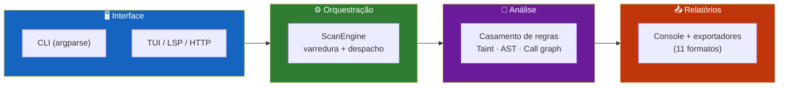
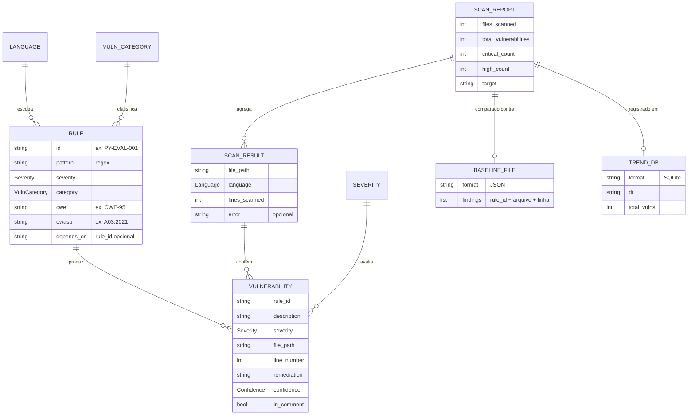
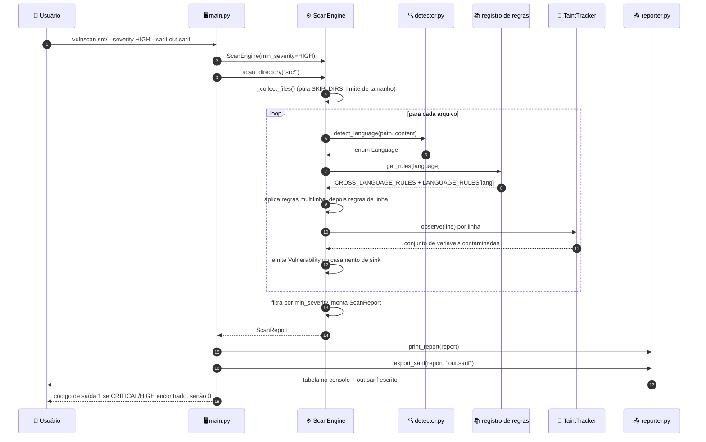
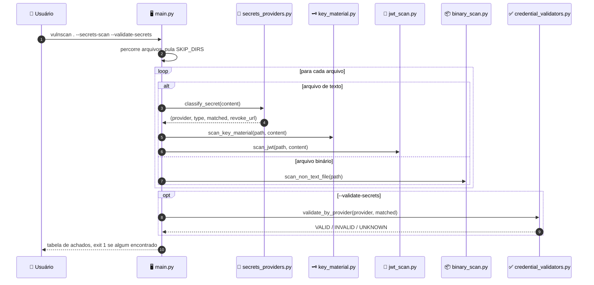
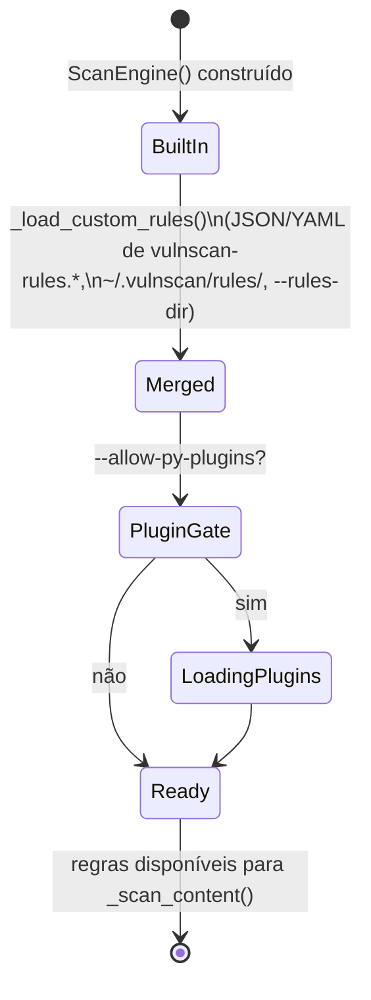
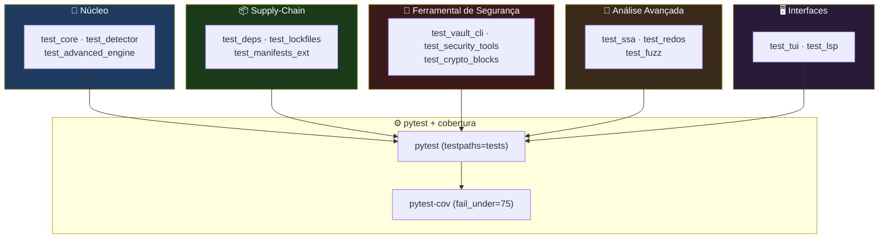

<div align="center">

**🌐 Choose Language / Selecione o Idioma / Elija el Idioma**

[](README.md)&nbsp;&nbsp;&nbsp;[](README_PT.md)&nbsp;&nbsp;&nbsp;[](README_ES.md)

</div>

---

<div align="center">

```
██╗   ██╗██╗   ██╗██╗     ███╗   ██╗███████╗ ██████╗ █████╗ ███╗   ██╗
██║   ██║██║   ██║██║     ████╗  ██║██╔════╝██╔════╝██╔══██╗████╗  ██║
██║   ██║██║   ██║██║     ██╔██╗ ██║███████╗██║     ███████║██╔██╗ ██║
╚██╗ ██╔╝██║   ██║██║     ██║╚██╗██║╚════██║██║     ██╔══██║██║╚██╗██║
 ╚████╔╝ ╚██████╔╝███████╗██║ ╚████║███████║╚██████╗██║  ██║██║ ╚████║
  ╚═══╝   ╚═════╝ ╚══════╝╚═╝  ╚═══╝╚══════╝ ╚═════╝ ╚═╝  ╚═╝╚═╝  ╚═══╝
        Análise estática multi-linguagem para vulnerabilidades, segredos e supply chain
```

---

[](https://www.python.org/)
[](https://github.com/Textualize/rich)
[]()
[]()
[]()
[](.github/workflows/ci.yml)

<br/>

> **Uma CLI Python de dependência única que transforma uma pasta de código-fonte em**
> uma lista ranqueada de vulnerabilidades, segredos vazados, dependências vulneráveis e achados SARIF.

<br/>


</div>

---

## 📑 Índice

<details>
<summary>▶️ <strong>Clique para expandir / recolher esta seção</strong></summary>

<table>
<tr>
<td valign="top" width="50%">

**🏗️ Sistema**
- [Visão Geral](#-visão-geral)
- [Arquitetura do Sistema](#-arquitetura-do-sistema)
- [Stack Tecnológica](#-stack-tecnológica)
- [Padrões de Projeto](#-padrões-de-projeto-aplicados)
- [Estrutura do Projeto](#-estrutura-do-projeto)

**📦 Módulos**
- [ScanEngine — Orquestrador Central](#-scanengine--orquestrador-central)
- [Registro de Regras](#-registro-de-regras)
- [Detector, Reporter & Taint Tracker](#-detector-reporter--taint-tracker)
- [Complexidade & Motor AST](#-complexidade--motor-ast)
- [Módulos de Segredos & Entropia](#-módulos-de-segredos--entropia)
- [Módulos de Dependências / Supply-Chain](#-módulos-de-dependências--supply-chain)
- [Vault, TUI, LSP & Ponto de Entrada CLI](#-vault-tui-lsp--ponto-de-entrada-cli)

</td>
<td valign="top" width="50%">

**💼 Negócio**
- [Regras de Negócio](#-regras-de-negócio)
- [Requisitos Funcionais](#-requisitos-funcionais)
- [Requisitos Não Funcionais](#-requisitos-não-funcionais)

**📐 Design**
- [Modelo de Dados](#-modelo-de-dados)
- [Fluxos do Sistema](#-fluxos-do-sistema)
- [Fluxo de Scan de Diretório](#fluxo-de-scan-de-diretório)
- [Fluxo SARIF / CI](#fluxo-github-action--sarif)
- [Fluxo de Scan de Segredos](#fluxo-de-scan-de-segredos)
- [Máquina de Estados de Carregamento de Regras](#máquina-de-estados-de-carregamento-de-regras)

**🔐 Segurança & Operação**
- [Segurança](#-segurança)
- [Instalação & Execução](#-instalação--execução)
- [Testes Automatizados](#-testes-automatizados)
- [Métricas & Monitoramento](#-métricas--monitoramento)
- [Limitações Conhecidas](#-limitações-conhecidas)

</td>
</tr>
</table>

---

</details>

## 🌟 Visão Geral

<details>
<summary>▶️ <strong>Clique para expandir / recolher esta seção</strong></summary>

**CodeVulnerableAnalyzer** (nome da CLI `vulnscan`) é uma ferramenta Python de análise estática, empacotada como `code-vulnerable-analyzer`, que escaneia árvores de código-fonte em busca de vulnerabilidades de segurança, problemas de qualidade de código, segredos vazados e dependências de terceiros vulneráveis. É distribuída como um único pacote Python (`analyzer/`) mais um ponto de entrada CLI enxuto (`main.py`), e depende de exatamente uma biblioteca externa em runtime: **Rich**, usada para a interface de terminal (barras de progresso, tabelas, snippets com realce de sintaxe).

O motor funciona aplicando um registro de **912 regras baseadas em padrões** (regex e matchers multilinha simples definidos como dataclasses `Rule`) em **145 linguagens reconhecidas** — desde linguagens mainstream (Python, JavaScript, Java, Go, C#) até infraestrutura como código (Terraform, CloudFormation, manifests Kubernetes, workflows GitHub Actions), linguagens de smart contract (Solidity, Vyper, Move, Cairo) e linguagens legadas corporativas (COBOL, ABAP, RPG). Além das regras regex, o código adiciona um **taint tracker** intra-arquivo (`analyzer/taint.py`) que segue variáveis desde a entrada do usuário até sinks perigosos, um **motor AST** Python (`analyzer/pyast_engine.py`) para análise de CFG/dataflow, e um construtor de **call graph** (`analyzer/callgraph.py`) para taint interprocedural entre arquivos.

Além do scanner principal de vulnerabilidades, o projeto agrupa ferramental de segurança adjacente sob a mesma CLI: um **scanner de segredos** com mais de 100 assinaturas de provedores, detecção de PII para documentos brasileiros (CPF/CNPJ), um **cofre criptografado AES-256**, **geração de SBOM** (CycloneDX/SPDX), **scan de dependências baseado em CVE**, uma **GitHub Action** (`action.yml`) que publica SARIF no GitHub Code Scanning, e um **Dockerfile** para execução em container.

### 🎯 Objetivos do Sistema

| Objetivo | Descrição |
|-----------|-------------|
| 🛡️ **Detecção de Vulnerabilidades** | Aplicar 912 regras em 145 linguagens para sinalizar SQLi, XSS, injeção de comando, desserialização insegura e mais |
| 🔍 **Análise de Taint** | Rastrear dados controlados pelo usuário da origem ao sink, intra-arquivo e (com `--call-graph`) entre arquivos |
| 🔑 **Detecção de Segredos** | Encontrar credenciais fixas via 100+ assinaturas de provedores, entropia de Shannon, JWT e inspeção de chaves PEM/DER |
| 📦 **Scan de Supply-Chain** | Detectar dependências vulneráveis (CVE) em requirements.txt, package.json, pom.xml, Cargo.toml, go.mod e mais |
| 📄 **Relatórios Multi-Formato** | Exportar JSON, HTML, SARIF, CSV, JUnit XML, Markdown, PDF, DOCX, XLSX, GitLab SAST e HTML interativo |
| 🔐 **Armazenamento de Segredos** | Fornecer um cofre criptografado AES-256 (`--vault`) com acesso via CLI e REST |
| 🤖 **Integração CI/CD** | Distribuir uma GitHub Action composta que escaneia, publica SARIF e bloqueia o build por severidade |
| 🧭 **Ergonomia do Desenvolvedor** | Oferecer uma TUI (`--interactive`), instalador de hook pre-commit do git, servidor LSP e modo watch |

---

</details>

## 🏗️ Arquitetura do Sistema

<details>
<summary>▶️ <strong>Clique para expandir / recolher esta seção</strong></summary>

### Diagrama de Módulos

```mermaid
flowchart TB
    subgraph CLI["🖥️  PONTO DE ENTRADA"]
        MAIN["main.py\nargparse · 40+ flags\ndespacho de modo"]
    end

    subgraph CORE["⚙️  MOTOR CENTRAL — analyzer/"]
        direction TB
        ENGINE["ScanEngine (engine.py)\nscan_file / scan_directory"]
        DETECT["detect_language (detector.py)\n145 linguagens"]
        RULES["get_rules() (rules/__init__.py)\n912 regras · 81 arquivos"]
        TAINT["TaintTracker (taint.py)"]
        AST["analyze_python_ast (pyast_engine.py)\n--ast-analysis"]
        CG["build_call_graph (callgraph.py)\n--call-graph"]
    end

    subgraph EXT["🧩  SCANS ESTENDIDOS"]
        direction LR
        SECRETS["secrets_providers · key_material\njwt_scan · binary_scan · entropy · pii"]
        DEPS["deps · sbom · manifests_ext\nlockfiles · dep_health · hash_pinning"]
        VAULT["vault_cli.py — AES-256 + REST"]
        IAC["iac / iac_render\nregras terraform/docker/k8s/gha"]
    end

    subgraph OUT["📤  RELATÓRIOS"]
        FILES["reporter.py + reporting_ext.py\nJSON·HTML·SARIF·CSV·JUnit·MD·PDF·DOCX·XLSX·GitLab·badge"]
    end

    subgraph ITF["🌐  INTERFACES"]
        direction LR
        TUI["tui.py / lsp.py"]
        SERVER["--serve API HTTP"]
        HOOK["--install-hook"]
    end

    MAIN --> ENGINE
    ENGINE --> DETECT
    ENGINE --> RULES
    ENGINE --> TAINT
    ENGINE -.-> AST
    ENGINE -.-> CG
    MAIN --> SECRETS & DEPS & VAULT & IAC
    ENGINE --> FILES
    MAIN --> TUI & SERVER & HOOK

    style CLI fill:#1e3a5f,color:#fff,stroke:#4a90d9
    style CORE fill:#1a3a1a,color:#fff,stroke:#4caf50
    style EXT fill:#3a1a1a,color:#fff,stroke:#e57373
    style OUT fill:#3a2a1a,color:#fff,stroke:#ffb74d
    style ITF fill:#2a1a3a,color:#fff,stroke:#ce93d8
```



### Camadas da Arquitetura



---

</details>

## 🛠️ Stack Tecnológica

<details>
<summary>▶️ <strong>Clique para expandir / recolher esta seção</strong></summary>

<table>
<thead>
<tr>
<th>Camada</th>
<th>Tecnologia</th>
<th>Versão</th>
<th>Propósito</th>
</tr>
</thead>
<tbody>
<tr>
<td rowspan="2"><strong>🧠 Linguagem / Runtime</strong></td>
<td>Python</td>
<td>&gt;= 3.10 (Docker: 3.13-slim)</td>
<td>Única linguagem de implementação (<code>requires-python</code> em <code>pyproject.toml</code>)</td>
</tr>
<tr>
<td>Stdlib CPython</td>
<td>—</td>
<td><code>argparse</code>, <code>re</code>, <code>ast</code>, <code>http.server</code>, <code>tomllib</code>, <code>importlib</code></td>
</tr>
<tr>
<td rowspan="1"><strong>📦 Dependência de Runtime</strong></td>
<td>Rich</td>
<td>&gt;=13.7.0,&lt;14.0.0</td>
<td>UI de terminal: <code>Console</code>, <code>Table</code>, <code>Progress</code>, <code>Panel</code>, <code>Syntax</code> — a única dependência de produção</td>
</tr>
<tr>
<td rowspan="4"><strong>🧪 Dev / Qualidade</strong></td>
<td>ruff</td>
<td>&gt;=0.6</td>
<td>Gate de lint: conjuntos <code>F</code>, <code>I</code>, <code>UP</code>, <code>E</code>/<code>W</code>, <code>B</code> (bloqueante no CI)</td>
</tr>
<tr>
<td>mypy</td>
<td>&gt;=1.11</td>
<td>Tipagem gradual (<code>check_untyped_defs = false</code>)</td>
</tr>
<tr>
<td>pytest</td>
<td>&gt;=8</td>
<td>Executor de testes (<code>testpaths = ["tests"]</code>)</td>
</tr>
<tr>
<td>pytest-cov</td>
<td>&gt;=5</td>
<td>Medição de cobertura, piso 75% (<code>fail_under</code>)</td>
</tr>
<tr>
<td rowspan="2"><strong>📦 Empacotamento</strong></td>
<td>setuptools</td>
<td>&gt;=70</td>
<td>Build backend (<code>setuptools.build_meta</code>)</td>
</tr>
<tr>
<td>Nome no PyPI</td>
<td>code-vulnerable-analyzer</td>
<td>Entrypoint de console <code>vulnscan = "main:main"</code></td>
</tr>
<tr>
<td rowspan="2"><strong>🐳 Container</strong></td>
<td>Imagem base Docker</td>
<td>python:3.13-slim</td>
<td><code>Dockerfile</code> — usuário não-root <code>vulnscan</code>, entrypoint <code>python main.py</code></td>
</tr>
<tr>
<td>Entrypoint</td>
<td>—</td>
<td><code>ENTRYPOINT ["python", "main.py"]</code></td>
</tr>
<tr>
<td rowspan="2"><strong>🤖 CI/CD</strong></td>
<td>GitHub Actions</td>
<td>—</td>
<td><code>.github/workflows/ci.yml</code>; o projeto também é distribuído como uma composite action reutilizável (<code>action.yml</code>)</td>
</tr>
<tr>
<td>Upload SARIF</td>
<td>codeql-action/upload-sarif@v3</td>
<td>Publica achados no GitHub Code Scanning</td>
</tr>
<tr>
<td><strong>📄 Formatos de Exportação</strong></td>
<td>JSON / HTML / SARIF 2.1 / CSV / JUnit XML / Markdown / PDF / DOCX / XLSX / GitLab SAST / HTML interativo / badge SVG</td>
<td>—</td>
<td>Implementado em <code>reporter.py</code> e <code>reporting_ext.py</code></td>
</tr>
</tbody>
</table>

---

</details>

## 🎨 Padrões de Projeto Aplicados

<details>
<summary>▶️ <strong>Clique para expandir / recolher esta seção</strong></summary>

| Padrão | Onde | Justificativa |
|---------|-------|-----------|
| 🗂️ **Registry** | `analyzer/rules/__init__.py` — `LANGUAGE_RULES`, `CROSS_LANGUAGE_RULES` | Cada módulo de regras se registra em um dict central indexado por `Language`, consultado via `get_rules()` |
| 🧱 **Dataclass Value Object** | `Rule` (`rules/base.py`), `Vulnerability`, `ScanResult`, `ScanReport` (`models.py`) | Registros imutáveis por convenção que atravessam todo o pipeline |
| 🎯 **Strategy** | Funções de exportação (`export_json`, `export_sarif`, `export_html`, …) em `reporter.py` | Cada formato de saída é uma função intercambiável que recebe o mesmo `ScanReport` |
| 🏭 **Factory (construção de regras)** | `_rule_from_entry()` em `engine.py` | Converte um dict JSON/YAML em um objeto `Rule`, usado por `--rules-dir` |
| 🔌 **Plugin** | `_load_py_plugin_rules()` atrás de `--allow-py-plugins` | Carrega listas `RULES` de terceiros a partir de módulos `.py` — opt-in explícito para execução de código arbitrário |
| 👂 **Observer / Callback** | `ScanEngine(on_file_start=..., on_file_done=...)` | O `ScanTracker` do `main.py` atualiza a barra `Progress` do Rich conforme os arquivos são escaneados |
| 🧭 **Facade** | `ScanEngine.scan_directory()` / `scan_files()` | Esconde coleta de arquivos, detecção de linguagem, casamento de regras e análise de taint atrás de dois métodos |
| 🚦 **Guard Clause / Saída Antecipada** | Limite de tamanho de arquivo, filtro `min_severity`, exclusão `SKIP_DIRS` em `engine.py` e `detector.py` | Verificações baratas cortam caminho antes de casamentos de regra custosos |
| 🔁 **Template Method (despacho por linguagem)** | `_LANG_MAP` em `main.py`, `EXTENSION_MAP` em `detector.py` | Um único pipeline de scan ramifica seu conjunto de regras pela `Language` detectada |
| 🧮 **Incremental / Memoização** | `IncrementalCache` (`incremental.py`) usado com `--incremental` | Evita re-escanear arquivos cujo hash de conteúdo não mudou |

---

</details>

## 📁 Estrutura do Projeto

<details>
<summary>▶️ <strong>Clique para expandir / recolher esta seção</strong></summary>

```
CodeVulnerableAnalyzer/
│
├── 📄 main.py                       # Ponto de entrada CLI — argparse, despacho de modo, 40+ flags
├── 📄 pyproject.toml                # Metadados do pacote, config ruff/mypy/pytest/coverage
├── 📄 requirements.txt              # Única dependência de runtime: rich>=13.7.0,<14.0.0
├── 📄 MANIFEST.in                   # Regras de inclusão de arquivos na sdist
├── 📄 pytest.ini                    # Configuração do pytest
├── 📄 action.yml                    # GitHub composite Action — scan + upload SARIF
├── 📄 Dockerfile                    # python:3.13-slim, usuário não-root, ENTRYPOINT main.py
├── 📄 vulnscan.bat                  # Launcher Windows (wrapper chcp utf8)
├── 📄 vulnscan.sh                   # Launcher POSIX
│
├── 📂 analyzer/                     # ★ Pacote central (141 arquivos .py)
│   ├── 📄 __init__.py, models.py    # __version__; Severity, Confidence, Language (145), VulnCategory
│   ├── 📄 engine.py, detector.py    # Loop de aplicação de regras do ScanEngine; detecção de linguagem + SKIP_DIRS
│   ├── 📄 taint.py, callgraph.py    # Rastreamento de taint intra-arquivo; call graph interprocedural (--call-graph)
│   ├── 📄 pyast_engine.py           # Análise AST Python (CFG, dataflow, dead code, TOCTOU)
│   ├── 📄 complexity.py             # Achados de complexidade ciclomática / manutenibilidade
│   ├── 📄 reporter.py, reporting_ext.py  # Console + JSON/HTML/SARIF/CSV/JUnit/MD/PDF/DOCX/XLSX/GitLab
│   ├── 📄 baseline.py, incremental.py    # --diff/--save-baseline; cache por hash de conteúdo para --incremental
│   ├── 📄 entropy.py, pii.py             # Segredos por entropia de Shannon; CPF/CNPJ/cartão/e-mail/telefone
│   ├── 📄 secrets_providers.py, key_material.py, jwt_scan.py, binary_scan.py  # Scan de segredos/JWT/chave/binário
│   ├── 📄 credential_validators.py, secret_history.py, secrets_baseline.py    # Validação, histórico git, baseline
│   ├── 📄 vault_cli.py              # CLI do cofre AES-256 + servidor REST
│   ├── 📄 deps.py, manifests_ext.py, lockfiles.py   # Scan de CVE, ecossistemas estendidos, árvore de dependências
│   ├── 📄 dep_health.py, dep_autofix.py, hash_pinning.py  # Typosquat/licença/abandono, planos de bump
│   ├── 📄 sbom.py, sbom_ext.py, vex.py   # SBOM CycloneDX/SPDX, supressão VEX
│   ├── 📄 mobile_archive.py, iac.py, iac_render.py  # Inspeção APK/IPA; renderização de IaC
│   ├── 📄 tui.py, lsp.py, trend.py       # TUI interativa; servidor LSP; histórico SQLite + gráfico de tendência
│   ├── 📄 remediation.py, ai_triage.py   # Codemods determinísticos de autofix; explicações modo educação
│   ├── 📄 i18n.py, theme.py, compliance.py  # Locale pt/en; temas de terminal; mapeamento de compliance
│   └── 📂 rules/                    # ★ 912 regras em 81 arquivos
│       ├── 📄 base.py, __init__.py  # Dataclass Rule; registro LANGUAGE_RULES, get_rules(), rule_count()
│       ├── 📄 python_rules.py, javascript_rules.py, sql_rules.py  # Regras de linguagens mainstream
│       ├── 📄 terraform_rules.py, docker_rules.py, k8s_rules.py, gha_rules.py  # IaC
│       ├── 📄 solidity_rules.py, vyper_rules.py, move_rules.py, cairo_rules.py # Smart contracts
│       ├── 📄 quality_*.py, solid_rules.py, architecture_rules.py              # Qualidade de código / SOLID
│       └── 📄 … (mais 71 arquivos de regras por linguagem/domínio)
│
├── 📂 tests/                        # 25 arquivos de teste (pytest)
│   ├── 📄 test_core.py, test_detector.py, test_advanced_engine.py
│   ├── 📄 test_deps.py, test_lockfiles.py, test_manifests_ext.py
│   ├── 📄 test_secrets_and_supplychain.py, test_risk_and_supplychain.py
│   ├── 📄 test_vault_cli.py, test_lsp.py, test_tui.py
│   ├── 📄 test_fuzz.py, test_redos.py, test_ssa.py, test_crypto_blocks.py
│   ├── 📄 test_platform_expansion.py, test_module_coverage.py
│   ├── 📂 benchmark/                # corpus.py + __init__.py — benchmarks de performance
│   └── 📂 samples/vulnerable_app.py # Fixture de amostra intencionalmente vulnerável
│
├── 📂 docs/                         # ACCESSIBILITY, AI_TRIAGE, AUTOFIX, COVERAGE_LIMITS, EDUCATION, PERFORMANCE, TUTORIAL
├── 📂 scripts/                      # Template do hook pre-commit + scripts auxiliares
├── 📂 benchmarks/                   # Harness de benchmark independente
├── 📂 integrations/                 # Ligações de integração com terceiros
├── 📂 desktop/, web/, mobile-companion/, vscode-ext/  # Clientes complementares (fora do escopo deste README)
├── 📂 packaging/                    # Ativos de empacotamento de distribuição
├── 📂 .github/workflows/ci.yml      # CI: lint (ruff), checagem de tipos (mypy), testes (pytest + coverage)
│
├── 📄 README.md                     # 🇺🇸 English (primário)
├── 📄 README_PT.md                  # 🇧🇷 Português
└── 📄 README_ES.md                  # 🇪🇸 Español
```

---

</details>

## 📦 Módulos do Sistema

<details>
<summary>▶️ <strong>Clique para expandir / recolher esta seção</strong></summary>

### 🎛️ ScanEngine — Orquestrador Central

`analyzer/engine.py` define `ScanEngine`, a classe que todo modo de scan chama em última instância. Ela é responsável pela coleta de arquivos, aplicação de regras, análise de taint, cache incremental e filtragem por severidade.

| Responsabilidade | Implementação |
|-----------------|----------------|
| Descoberta de arquivos | `_collect_files()` — `Path.rglob("*")` filtrado por `is_scannable()` e `SKIP_DIRS` |
| Aplicação de regras | `_scan_content()` — itera regras `Rule` de linha única e depois multilinha, respeita encadeamento `depends_on` |
| Análise de taint | `_analyze_taint()` — `TaintTracker.observe()` por linha mais a tabela regex `TAINT_SINKS` |
| Regras customizadas | `_load_custom_rules()` — mescla `vulnscan-rules.json/yaml`, `~/.vulnscan/rules/`, `--rules-dir`, `VULNSCAN_RULES_DIR` |
| Arquivo de config | `_load_config()` — lê `vulnscan.toml` / `vulnscan.json` para `severity_overrides` e `suppress` |
| Supressão | `# vulnscan: ignore RULE_ID` inline, arquivo `.vulnscan-ignore`, e lista `suppress` de config |
| Scan incremental | `IncrementalCache` (opt-in via `--incremental`) — pula conteúdo de arquivo inalterado |

---

### 📚 Registro de Regras

`analyzer/rules/__init__.py` agrega cada módulo de regras em `LANGUAGE_RULES: dict[Language, list[Rule]]` e `CROSS_LANGUAGE_RULES` (regras genéricas + qualidade + SOLID + arquitetura que se aplicam independentemente da linguagem).

| Função | Propósito |
|----------|---------|
| `get_rules(language)` | Retorna `CROSS_LANGUAGE_RULES + LANGUAGE_RULES[language]` para um scan |
| `get_all_rules()` | Lista plana deduplicada de todas as 912 regras, usada por `--rules` |
| `rule_count()` | `len(get_all_rules())` — impresso no banner inicial |
| `Rule` (`rules/base.py`) | Dataclass: `id`, `name`, `pattern` (regex), `severity`, `category`, `language`, `cwe`, `owasp`, `confidence`, `negative_pattern`, `multiline`, `depends_on` |

Cada arquivo de regras (ex.: `python_rules.py`, `terraform_rules.py`, `solidity_rules.py`) exporta uma constante `list[Rule]` de nível de módulo que o registro importa e mescla.

---

### 🔍 Detector, Reporter & Taint Tracker

`analyzer/detector.py` mapeia caminhos de arquivo para um membro `Language` via `EXTENSION_MAP` com fallback por shebang, mais `is_scannable()` e o conjunto de exclusão `SKIP_DIRS` (`.git`, `node_modules`, `__pycache__`, `build`, …). `analyzer/reporter.py` renderiza resultados no terminal e exporta `JSON`/`HTML`/`SARIF 2.1`/`CSV`/`JUnit`/`Markdown`/badges SVG; `analyzer/reporting_ext.py` adiciona `PDF`/`DOCX`/`XLSX`/GitLab SAST/HTML interativo. `analyzer/taint.py` implementa `TaintTracker`, observando cada linha em busca de fontes de taint (`request.args`, `input()`, `os.environ`) e propagando o taint por atribuição, sinalizando `TAINT-001` quando uma variável contaminada alcança uma entrada de `TAINT_SINKS` (`execute(`, `os.system(`) sem sanitização aparente.

| Função | Formato / Papel |
|----------|--------|
| `export_json` / `export_html` / `export_sarif` | JSON, HTML estático, SARIF 2.1 (GitHub Code Scanning, VS Code) |
| `export_csv` / `export_junit` / `export_markdown` / `export_badge` | Planilha, relatório de teste de CI, docs, badge SVG |
| `export_pdf` / `export_docx` / `export_xlsx` (reporting_ext) | Documentos de relatório técnico |
| `gitlab_sast` / `interactive_html` (reporting_ext) | JSON GitLab SAST, HTML interativo autocontido |

---

### 🧮 Complexidade & Motor AST

`analyzer/complexity.py` calcula achados de complexidade ciclomática anexados a todo resultado de scan. `analyzer/pyast_engine.py` (`--ast-analysis`) realiza parsing AST real para Python: construção de CFG, dataflow, detecção de dead-code, recursão sem caso-base, condições de corrida TOCTOU e padrões use-after-close/null-dereference — capacidades que regras regex simples não conseguem expressar. `analyzer/callgraph.py` (`--call-graph`) constrói um call graph interprocedural e roda análise de taint entre arquivos sobre ele.

---

### 🔑 Módulos de Segredos & Entropia

| Módulo | Papel |
|--------|------|
| `secrets_providers.py` / `entropy.py` / `pii.py` | 100+ assinaturas de provedores (`--secrets-scan`); detecção por entropia de Shannon (`--entropy`); CPF/CNPJ/cartão/e-mail/telefone (`--pii`) |
| `key_material.py` / `jwt_scan.py` / `binary_scan.py` | Detecção de chave privada PEM/DER; fraquezas estruturais de JWT; segredos dentro de binários/EXIF/PDF/`.env` |
| `credential_validators.py` / `secret_history.py` / `secrets_baseline.py` | Validação ativa de credenciais (`--validate-secrets`); scan de histórico git/patch; supressão via baseline |

---

### 📦 Módulos de Dependências / Supply-Chain

| Módulo | Papel |
|--------|------|
| `deps.py` | `scan_manifest_dir()` — busca de CVE para requirements.txt, package.json, pom.xml, Cargo.toml, go.mod, .csproj; `scan_manifest_dir_osv()` cruza com OSV.dev |
| `manifests_ext.py` / `lockfiles.py` | Ecossistemas estendidos (Composer, Gemfile, NuGet, pubspec, SwiftPM, CocoaPods, …); árvore transitiva de dependências (`--dep-tree`) |
| `dep_health.py` / `dep_autofix.py` / `hash_pinning.py` | Checagens de typosquat/licença/abandono; diffs de atualização via `build_bump_plan()`; integridade de hash/pinning de lockfiles |
| `sbom.py` / `sbom_ext.py` / `vex.py` | Geração de SBOM CycloneDX/SPDX; supressão de CVE via documento VEX |

---

### 🔐 Vault, TUI, LSP & Ponto de Entrada CLI

`analyzer/vault_cli.py` implementa um cofre local de segredos criptografado com AES-256, acessível via `--vault FILE` mais `--vault-init/-set/-get/-list/-delete/-passwd`, e um servidor REST opcional (`--vault-serve PORT`).

| Módulo | Papel |
|--------|------|
| `main.py` | CLI baseada em argparse, despacho de modo (scan / stdin / server / vault / call-graph / trend / rules / langs) |
| `tui.py` / `lsp.py` | UI de terminal interativa em tela cheia (`--interactive`); servidor LSP sobre stdio para editores (`--lsp`) |
| `trend.py` | `TrendDB` — histórico de scans em SQLite com gráfico de tendência ASCII (`--trend`) |

---

</details>

## 💼 Regras de Negócio

<details>
<summary>▶️ <strong>Clique para expandir / recolher esta seção</strong></summary>

### 🔎 Regras de Scan

| # | Regra | Aplicação |
|---|------|-------------|
| RN-01 | Arquivos maiores que 5 MB são pulados, não escaneados | Checagem `MAX_FILE_SIZE_MB = 5` em `ScanEngine.scan_file` |
| RN-02 | Linhas com mais de 2000 caracteres são puladas no casamento de padrões | `MAX_LINE_LENGTH = 2000` em `engine.py` |
| RN-03 | Diretórios em `SKIP_DIRS` (ex.: `.git`, `node_modules`, `build`) nunca são percorridos | Filtro de `_collect_files()` |
| RN-04 | Um achado dispara no máximo uma vez por `(rule_id, file_path, line_number)` | Chave de dedup `seen: set[tuple]` em `_scan_content` |
| RN-05 | Regras com `depends_on` só avaliam depois que sua regra dependente já disparou naquele arquivo | Portão `fired: set[str]` em `_scan_content` |
| RN-06 | Achados dentro de comentários têm sua confiança rebaixada, não descartada, exceto com `--no-comments` | Rastreamento de bloco de comentário + rebaixamento de `Confidence` |

### 🎚️ Regras de Severidade & Supressão

| # | Regra | Aplicação |
|---|------|-------------|
| RN-07 | Somente achados em ou acima de `--severity` (padrão `INFO`) são reportados | Filtro `severity.value >= self.min_severity.value` |
| RN-08 | `# vulnscan: ignore RULE_ID` inline suprime aquele achado naquela linha | Casamento regex em `_is_inline_suppressed()` |
| RN-09 | Um arquivo `.vulnscan-ignore` na raiz do scan suprime `RULE_ID` ou `FILE:RULE_ID` globalmente | `_load_ignore_file()` |
| RN-10 | `severity_overrides` de `vulnscan.toml`/`vulnscan.json` substitui a severidade padrão de uma regra | `_severity_overrides_from_config()` |
| RN-11 | O código de saída é `1` quando o relatório contém qualquer achado CRITICAL ou HIGH, senão `0` | `return 1 if (...) else 0` final em `main()` |

### 🔑 Regras de Segredos & Vault

| # | Regra | Aplicação |
|---|------|-------------|
| RN-12 | `--validate-secrets` só executa quando `--secrets-scan` também está definido e requer acesso à rede | `args.validate_secrets` checado dentro do branch `secrets_scan` |
| RN-13 | `--allow-py-plugins` é obrigatório antes que qualquer plugin `.py` de regra seja executado | Flag de opt-in explícito controlando `_load_py_plugin_rules()` |
| RN-14 | A GitHub Action falha o build quando a severidade `fail-on` (padrão `HIGH`) é encontrada | `action.yml` — conta CRITICAL/HIGH do SARIF, `exit 1` |

---

</details>

## ✅ Requisitos Funcionais

<details>
<summary>▶️ <strong>Clique para expandir / recolher esta seção</strong></summary>

| ID | Requisito | Prioridade | Status |
|----|-------------|----------|--------|
| **RF-01** | O sistema deve escanear um único arquivo ou uma árvore de diretório inteira em busca de vulnerabilidades | 🔴 Alta | ✅ Implementado |
| **RF-02** | O sistema deve detectar a linguagem de um arquivo pela extensão ou shebang | 🔴 Alta | ✅ Implementado |
| **RF-03** | O sistema deve aplicar regras específicas de linguagem e transversais aos arquivos casados | 🔴 Alta | ✅ Implementado |
| **RF-04** | O sistema deve rastrear dados contaminados da origem ao sink dentro de um arquivo | 🔴 Alta | ✅ Implementado |
| **RF-05** | O sistema deve, opcionalmente, construir um call graph e rastrear taint entre arquivos (`--call-graph`) | 🟡 Média | ✅ Implementado |
| **RF-06** | O sistema deve filtrar achados por severidade mínima via `--severity` | 🔴 Alta | ✅ Implementado |
| **RF-07** | O sistema deve filtrar achados por linguagem via `--lang` | 🟡 Média | ✅ Implementado |
| **RF-08** | O sistema deve exportar achados como JSON, HTML, SARIF, CSV, JUnit XML e Markdown | 🔴 Alta | ✅ Implementado |
| **RF-09** | O sistema deve exportar achados como PDF, DOCX, XLSX e JSON GitLab SAST | 🟡 Média | ✅ Implementado |
| **RF-10** | O sistema deve gerar um badge SVG resumindo a contagem de achados | 🟢 Baixa | ✅ Implementado |
| **RF-11** | O sistema deve comparar um scan contra um baseline JSON salvo (`--diff`) | 🟡 Média | ✅ Implementado |
| **RF-12** | O sistema deve escanear segredos fixos através de 100+ assinaturas de provedores | 🔴 Alta | ✅ Implementado |
| **RF-13** | O sistema deve detectar segredos por entropia de Shannon independentemente de assinaturas | 🟡 Média | ✅ Implementado |
| **RF-14** | O sistema deve detectar PII brasileiro (CPF, CNPJ, telefone) e números de cartão de crédito | 🟡 Média | ✅ Implementado |
| **RF-15** | O sistema deve escanear manifests de dependência em busca de CVEs conhecidos | 🔴 Alta | ✅ Implementado |
| **RF-16** | O sistema deve, opcionalmente, cruzar dependências com o OSV.dev (`--osv`) | 🟡 Média | ✅ Implementado |
| **RF-17** | O sistema deve gerar um SBOM CycloneDX ou SPDX | 🟡 Média | ✅ Implementado |
| **RF-18** | O sistema deve fornecer um cofre local de segredos criptografado com AES-256 | 🟡 Média | ✅ Implementado |
| **RF-19** | O sistema deve fornecer uma TUI interativa para navegar achados | 🟡 Média | ✅ Implementado |
| **RF-20** | O sistema deve fornecer um servidor LSP para integração com editores | 🟢 Baixa | ✅ Implementado |
| **RF-21** | O sistema deve fornecer um instalador de hook pre-commit do git | 🟡 Média | ✅ Implementado |
| **RF-22** | O sistema deve suportar re-scan contínuo em modo watch | 🟢 Baixa | ✅ Implementado |
| **RF-23** | O sistema deve expor uma API HTTP (`--serve PORT`) para integração com CI | 🟡 Média | ✅ Implementado |
| **RF-24** | O sistema deve suportar leitura de código-fonte via stdin para scan de um único trecho | 🟢 Baixa | ✅ Implementado |
| **RF-25** | O sistema deve gerar um diff de autofix determinístico para um subconjunto de achados | 🟢 Baixa | ⚠️ Parcial |
| **RF-26** | O sistema deve distribuir uma GitHub Action que publica SARIF no Code Scanning | 🔴 Alta | ✅ Implementado |

---

</details>

## ⚡ Requisitos Não Funcionais

<details>
<summary>▶️ <strong>Clique para expandir / recolher esta seção</strong></summary>

| ID | Categoria | Requisito | Alvo |
|----|----------|-------------|--------|
| **RNF-01** | ⚡ Performance | Arquivos acima de 5 MB são pulados em vez de degradar o tempo de scan | Limite fixo, `MAX_FILE_SIZE_MB = 5` |
| **RNF-02** | ⚡ Performance | Linhas acima de 2000 caracteres são puladas no casamento regex | Limite fixo, `MAX_LINE_LENGTH = 2000` |
| **RNF-03** | ⚡ Performance | Scans repetidos de arquivos inalterados reaproveitam resultados em cache | Cache por hash de conteúdo `--incremental` |
| **RNF-04** | 📦 Footprint | Exatamente uma dependência de runtime de terceiros | `rich>=13.7.0,<14.0.0` em `requirements.txt` |
| **RNF-05** | 🔧 Compatibilidade | Suportado em Python 3.10 e mais recente | `requires-python = ">=3.10"` |
| **RNF-06** | 🔧 Compatibilidade | Roda identicamente em Windows, macOS e Linux | Reconfiguração de console UTF-8 para `win32` em `main.py` |
| **RNF-07** | 🧪 Gate de Qualidade | Lint passa 100% no conjunto de regras ruff aplicado | `select = ["F","I","UP","E","W","B"]`, bloqueante no CI |
| **RNF-08** | 🧪 Gate de Qualidade | Cobertura de testes nunca regride abaixo do piso ratchet | `fail_under = 75` em `pyproject.toml` |
| **RNF-09** | 🔐 Segurança | Segredos do cofre são criptografados em repouso com AES-256 | `vault_cli.py` |
| **RNF-10** | 🔐 Segurança | Execução de plugin Python arbitrário requer opt-in explícito | Flag `--allow-py-plugins` |
| **RNF-11** | 🔐 Segurança | Validação ativa de credenciais contra APIs de provedor requer opt-in explícito | Flag `--validate-secrets`, uso de rede documentado |
| **RNF-12** | 🌍 Internacionalização | Rótulos de UI e texto de regras podem alternar entre Português e Inglês | `--locale {pt,en}`, `analyzer/i18n.py` |
| **RNF-13** | ♿ Usabilidade | Saída de terminal se adapta a temas dark, light e alto-contraste | `--theme {dark,light,high-contrast}`, `analyzer/theme.py` |
| **RNF-14** | 🧱 Manutenibilidade | Todo módulo de regras expõe uma única constante `list[Rule]` plana | Contrato consistente entre os 81 arquivos de regras |
| **RNF-15** | 🤖 CI/CD | A GitHub Action deve rodar sem configuração adicional além de `path` | Valores padrão de `action.yml` para toda entrada |
| **RNF-16** | 📈 Observabilidade | Todo scan completado é registrado em um banco de tendências local | `TrendDB().record(report)` envolvido em `try/except` de melhor esforço |

---

</details>

## 🗄️ Modelo de Dados

<details>
<summary>▶️ <strong>Clique para expandir / recolher esta seção</strong></summary>

O CodeVulnerableAnalyzer não possui banco de dados externo. Seu "modelo de dados" é o conjunto de dataclasses em memória definidas em `analyzer/models.py` que fluem de um arquivo escaneado até um relatório, mais os formatos em disco (baseline JSON, banco SQLite de tendências, arquivo de cofre criptografado) que persistem estado entre execuções.

### Diagrama Entidade-Relacionamento



### Especificação do Registro de Regras

| Campo | Tipo | Notas |
|-------|------|-------|
| `id` | `str` | Identificador estável de regra, ex. `PY-EVAL-001`, `TAINT-001` |
| `pattern` | `str` (regex) | Compilado uma vez por `Rule`; `negative_pattern` exclui casamentos opcionalmente |
| `severity` | enum `Severity` | `CRITICAL(5)` .. `INFO(1)`, sobrescrevível por regra via config |
| `category` | enum `VulnCategory` | ~60 categorias de `SQL_INJECTION` a `IAC_SECURITY` |
| `cwe` / `owasp` | `str \| None` | Identificador CWE e categoria OWASP Top 10, quando aplicável |
| `depends_on` | `str \| None` | `id` de outra regra que já deve ter disparado no mesmo arquivo |

### Formatos Persistidos

| Armazenamento | Formato | Escrito por |
|-------|--------|-----------|
| Baseline | JSON | `analyzer/baseline.py` (`--save-baseline`) |
| Histórico de tendências de scan | SQLite | `analyzer/trend.py` (`TrendDB`, automático a cada scan) |
| Baseline de segredos | JSON | `analyzer/secrets_baseline.py` (`--save-secrets-baseline`) |
| Vault | Binário criptografado AES-256 | `analyzer/vault_cli.py` (`--vault-init`) |
| Regras customizadas | JSON / YAML | `vulnscan-rules.json`, `vulnscan-rules.yaml`, `~/.vulnscan/rules/*` |
| Config | TOML / JSON | `vulnscan.toml` / `vulnscan.json` (`severity_overrides`, `suppress`) |

---

</details>

## 🔄 Fluxos do Sistema

<details>
<summary>▶️ <strong>Clique para expandir / recolher esta seção</strong></summary>

### Fluxo de Scan de Diretório



### Fluxo GitHub Action / SARIF

```mermaid
flowchart TD
    START([Workflow dispara action.yml]) --> SETUP[actions/setup-python@v5]
    SETUP --> INSTALL[pip install rich]
    INSTALL --> RUN["python main.py PATH\n--severity min-severity\n--sarif sarif-output --quiet"]
    RUN --> PARSE[Parseia SARIF: conta total/CRITICAL/HIGH]
    PARSE --> SUMMARY[Escreve tabela GITHUB_STEP_SUMMARY]
    SUMMARY --> UPLOAD{upload-sarif == true?}
    UPLOAD -- Sim --> CODEQL[github/codeql-action/upload-sarif@v3]
    UPLOAD -- Não --> GATE
    CODEQL --> GATE{severidade fail-on encontrada?}
    GATE -- Sim --> FAIL([exit 1 — build falha])
    GATE -- Não --> PASS([exit 0 — build passa])

    style START fill:#1565C0,color:#fff
    style PASS fill:#2E7D32,color:#fff
    style FAIL fill:#B71C1C,color:#fff
```

### Fluxo de Scan de Segredos



### Máquina de Estados de Carregamento de Regras



---

</details>

## 🔐 Segurança

<details>
<summary>▶️ <strong>Clique para expandir / recolher esta seção</strong></summary>

### Controles Implementados

| Controle | Implementação | Efeito |
|---------|----------------|--------|
| 🔌 **Opt-in explícito de plugin** | `--allow-py-plugins` controla `_load_py_plugin_rules()` | Módulos `.py` de regras de terceiros nunca executam a menos que explicitamente permitido |
| 🌐 **Opt-in explícito de rede** | `--osv`, `--validate-secrets`, `--check-abandoned` são flags opt-in | A ferramenta é totalmente offline por padrão; só essas flags fazem chamadas de rede |
| 🔐 **Cofre criptografado** | `analyzer/vault_cli.py` — criptografia AES-256 em repouso | Segredos armazenados localmente não ficam em texto plano |
| 🧾 **Trilha de auditoria de supressão** | `.vulnscan-ignore`, `# vulnscan: ignore` inline, `suppress` de config | Todo achado suprimido é rastreável a uma fonte explícita e revisável |
| 🐳 **Usuário não-root no container** | `Dockerfile` — `useradd --system --gid vulnscan` | A imagem Docker nunca roda o scanner como root |
| 📦 **Dependência de runtime única e fixada** | `requirements.txt` — `rich>=13.7.0,<14.0.0` | Superfície mínima de supply-chain; o próprio `requirements.txt` documenta um comando de verificação de hash |
| 🔍 **Achados SARIF alimentam o GitHub Code Scanning** | `action.yml` — `upload-sarif@v3` | Achados ficam visíveis na aba Security nativa do repositório, não só nos logs de CI |
| ✅ **Falha de CI condicionada por severidade** | `action.yml` — entrada `fail-on` (padrão `HIGH`) | Builds falham deterministicamente em achados CRITICAL/HIGH |
| 🪝 **Hook pre-commit** | `install_hook()` em `main.py` | Bloqueia commits locais contendo achados CRITICAL/HIGH antes que cheguem ao remoto |

### Limitações de Segurança Conhecidas

> [!WARNING]
> O CodeVulnerableAnalyzer é um analisador estático baseado em padrões/regex (mais um taint tracker leve e um motor AST Python). Não é uma ferramenta de verificação formal, e as limitações a seguir são inerentes a esse design.

| Limitação | Risco | Caminho de Mitigação |
|------------|------|-----------------|
| 🎯 **Casamento baseado em regex para a maioria das linguagens** | Falsos positivos/negativos comparado a análise AST completa, especialmente em código ofuscado ou multilinha | `--ast-analysis` fornece cobertura AST real apenas para Python; outras linguagens permanecem baseadas em padrões |
| 🔀 **Taint intra-arquivo por padrão** | Fluxo de dados entre funções ou arquivos é perdido a menos que `--call-graph` seja usado | Habilite `--call-graph` para projetos Python que precisam de cobertura interprocedural |
| 🧩 **`--allow-py-plugins` executa código arbitrário** | Um diretório de regras malicioso ou comprometido pode rodar Python arbitrário com os privilégios do scanner | Aponte `--rules-dir`/`VULNSCAN_RULES_DIR` apenas para diretórios confiáveis; a flag é opt-in e documentada como perigosa |
| 🔑 **`--validate-secrets` envia credenciais encontradas para APIs de terceiros** | A validação ativa chama endpoints de provedores com o segredo encontrado, uma saída de rede real (embora intencional) de dados sensíveis | Use apenas com autorização explícita em código que o usuário tem permissão para escanear |
| 🗝️ **A força da senha mestra do vault é controlada pelo usuário** | Uma senha mestra fraca compromete a criptografia AES-256 em repouso | Aplique uma política de senha forte externamente; a CLI ainda não rejeita senhas fracas |
| 📉 **Piso de cobertura é 75%, não 100%** | Alguns caminhos de código, especialmente em arquivos de regras de linguagens raras, não são exercitados por testes | `fail_under = 75` é um ratchet destinado a subir com o tempo, conforme o comentário em `pyproject.toml` |
| 🌐 **Checagens de OSV.dev e pacotes abandonados são chamadas de rede sem autenticação** | Resultados dependem da disponibilidade do serviço de terceiros e não são cacheados/fixados | Trate resultados de `--osv`/`--check-abandoned` como consultivos, não autoritativos |
| 🖊️ **Regras customizadas JSON/YAML são entrada confiada, não sandboxed** | Um `vulnscan-rules.json` malicioso poderia definir regras enganosas (embora não executar código) | Revise arquivos de regras customizadas de fontes não confiáveis antes de usar |

---

</details>

## 🚀 Instalação & Execução

<details>
<summary>▶️ <strong>Clique para expandir / recolher esta seção</strong></summary>

### Pré-requisitos

```bash
python --version        # espera 3.10+
pip --version            # para instalar a única dependência de runtime
```

### Build

```bash
pip install -e .                 # instalação editável para desenvolvimento local
pip install -e ".[dev]"          # + ferramental dev: ruff, mypy, pytest, pytest-cov
pip install -r requirements.txt  # ou apenas a dependência de runtime, rode main.py diretamente
```

### Execução

```bash
python main.py myapp/                        # escaneia um diretório recursivamente
python main.py src/auth.py                   # escaneia um único arquivo
python main.py . --severity HIGH             # apenas achados HIGH e CRITICAL
python main.py . --json report.json          # exporta JSON (também: --html --sarif --csv --junit --markdown)
python main.py . --deps --sbom sbom.json     # scan de CVE de dependências + geração de SBOM
python main.py . --secrets-scan --entropy --pii   # scans de segredos, entropia e PII
python main.py --interactive                 # TUI interativa
python main.py . --watch                     # modo watch, re-escaneia ao detectar alteração
python main.py . --serve 8080                # servidor API HTTP para CI
cat file.py | python main.py --stdin --lang python   # lê um único trecho de stdin
python main.py --install-hook                # instala o hook pre-commit do git
vulnscan.bat . --severity HIGH               # launcher Windows
./vulnscan.sh . --severity HIGH              # launcher POSIX

# Docker
docker build -t vulnscan .
docker run --rm -v "$(pwd)":/app/target vulnscan /app/target --severity HIGH
```

### Alvos equivalentes (flags do CLI)

| Alvo | Propósito |
|--------|---------|
| `python main.py --version` | Imprime a versão instalada (`2.0.0`) |
| `python main.py --rules` | Lista todas as 912 regras com severidade, CWE, OWASP |
| `python main.py --list-langs` | Lista todas as 145 linguagens suportadas por categoria |
| `python main.py . --summary-only` / `-q` | Imprime apenas métricas agregadas, sem detalhe por achado |
| `python main.py . --diff baseline.json` | Mostra apenas achados novos desde o baseline |
| `python main.py . --save-baseline FILE` | Persiste o scan atual como um novo baseline |
| `pip install -e ".[dev]" && ruff check .` | Roda o gate de lint aplicado |
| `mypy analyzer` | Roda a checagem de tipos gradual |
| `pytest` | Roda a suíte de testes completa com cobertura |

### Configuração de Build

| Config | Valor | Declarado em |
|---------|-------|-------------|
| `name` | `code-vulnerable-analyzer` | `pyproject.toml` `[project]` |
| `version` | `2.0.0` | `pyproject.toml`, `analyzer/__init__.py` |
| `requires-python` | `>=3.10` | `pyproject.toml` |
| Entrypoint `console_scripts` | `vulnscan = "main:main"` | `pyproject.toml` `[project.scripts]` |
| `packages.find.include` | `["analyzer*"]` | `pyproject.toml` `[tool.setuptools.packages.find]` |
| Imagem base Docker | `python:3.13-slim` | `Dockerfile` |
| Usuário Docker | `vulnscan` (não-root, system) | `Dockerfile` |
| `python-version` padrão da Action | `3.11` | `action.yml` |
| `fail-on` padrão da Action | `HIGH` | `action.yml` |

---

</details>

## 🧪 Testes Automatizados

<details>
<summary>▶️ <strong>Clique para expandir / recolher esta seção</strong></summary>

### Arquitetura de Testes



O repositório tem uma suíte de testes real e populada em `tests/` — **25 arquivos de teste**, incluindo um subpacote `benchmark/` e uma fixture `samples/vulnerable_app.py` usada como entrada intencionalmente vulnerável.

| Arquivo de teste | Foco |
|-----------|-------|
| `test_core.py`, `test_detector.py`, `test_advanced_engine.py` | Scan central, detecção de linguagem, opções avançadas do motor |
| `test_deps.py`, `test_lockfiles.py`, `test_manifests_ext.py` | Scan de CVE, árvores de dependência, ecossistemas de manifest estendidos |
| `test_secrets_and_supplychain.py`, `test_risk_and_supplychain.py` | Scan de segredos combinado com checagens de supply-chain |
| `test_vault_cli.py`, `test_security_tools.py`, `test_crypto_blocks.py` | CLI do cofre AES-256, ferramental de segurança, detecção de padrões crypto |
| `test_ssa.py`, `test_redos.py` | Internos de dataflow, detecção de padrões ReDoS |
| `test_remediation_expanded.py`, `test_fuzz.py` | Geração de codemods de autofix, robustez estilo fuzz |
| `test_tui.py`, `test_lsp.py` | Comportamento da TUI interativa e do servidor LSP |
| `test_platform_expansion.py`, `test_expansions_8_12.py`, `test_expansions_13_16.py` | Cobertura estendida de regras por linguagem/plataforma |
| `test_module_coverage.py` | Checagens de sanidade de import/cobertura entre módulos |
| `test_benchmark.py`, `benchmark/corpus.py` | Harness de benchmark de performance |

### Rodando os Testes

```bash
# Instalar dependências de dev
pip install -e ".[dev]"

# Rodar a suíte completa
pytest

# Rodar com relatório de cobertura (bate com o gate fail_under=75 do CI)
pytest --cov=analyzer --cov-report=term-missing

# Rodar um único arquivo de teste
pytest tests/test_core.py -v

# Rodar o gate de lint aplicado
ruff check .

# Rodar a checagem de tipos gradual
mypy analyzer
```

### Checklist de Aceitação Manual

| # | Cenário | Resultado esperado |
|---|----------|-----------------|
| 1 | `python main.py tests/samples/vulnerable_app.py` | Achados impressos com severidade, CWE, remediação |
| 2 | `python main.py . --severity CRITICAL` | Somente achados CRITICAL exibidos |
| 3 | `python main.py . --sarif out.sarif` e depois inspecionar `out.sarif` | SARIF 2.1 válido com `runs[].results[]` |
| 4 | `python main.py . --deps` num repo com dependência desatualizada | Tabela de dependências vulneráveis com CVE, versão instalada/corrigida |
| 5 | `python main.py . --secrets-scan` num arquivo com chave AWS falsa | Achado de segredo com nome do provedor e URL de revogação |
| 6 | `python main.py --rules` | Tabela de 912 regras, ordenadas por severidade |
| 7 | `python main.py --list-langs` | Tabela categorizada de 145 linguagens |
| 8 | `python main.py --install-hook` dentro de um repo git | `.git/hooks/pre-commit` criado e bloqueia commits CRITICAL/HIGH |
| 9 | `python main.py . --diff baseline.json` após `--save-baseline` | Somente achados novos desde o baseline são mostrados |
| 10 | `docker run vulnscan /app/target` | Mesmo comportamento da CLI nativa, rodando como não-root |

---

</details>

## 📊 Métricas & Monitoramento

<details>
<summary>▶️ <strong>Clique para expandir / recolher esta seção</strong></summary>

### Métricas do Código-Fonte

| Métrica | Valor |
|--------|-------|
| Arquivos Python em `analyzer/` | 141 |
| Arquivos de regras em `analyzer/rules/` | 81 |
| Total de regras registradas (`rule_count()`) | 912 |
| Linguagens suportadas (enum `Language`) | 145 |
| Arquivos de teste em `tests/` | 25 |
| Dependências de runtime | 1 (`rich`) |
| Piso de cobertura (ratchet) | 75% |
| Formatos de exportação | 11 (JSON, HTML, SARIF, CSV, JUnit, Markdown, PDF, DOCX, XLSX, GitLab SAST, HTML interativo) + badge SVG |

### Sinais de Runtime

| Sinal | Origem | Onde observar |
|--------|--------|------------------|
| Progresso do scan | `ScanTracker.on_file_start/on_file_done` | Barra `Progress` do Rich no terminal |
| Histórico de scans | `analyzer/trend.py` — `TrendDB().record(report)` | `python main.py --trend` |
| Métricas de profiling | `--profile-json FILE` | JSON com `wall_seconds`, `files_scanned`, `findings` |
| Saúde da API HTTP | `GET /health` em `--serve PORT` | JSON `{"status": "ok", "version": ..., "rules": ...}` |
| Resumo do step de CI | `action.yml` | Tabela markdown `GITHUB_STEP_SUMMARY` na execução do Actions |

### Comandos de Diagnóstico Úteis

```bash
# Contar achados por severidade a partir de uma exportação JSON
python -c "import json; d=json.load(open('report.json')); print(d.get('summary'))"

# Checar se a API HTTP está viva
curl http://localhost:8080/health

# Inspecionar o histórico de tendências de scan
python main.py --trend

# Listar todas as regras de uma linguagem específica
python main.py --rules | grep -i python

# Verificar o hash da dependência de runtime antes de instalar (documentado em requirements.txt)
pip download rich==13.9.4 && sha256sum rich-13.9.4-py3-none-any.whl
```

### Códigos de Saída Padronizados

| Código | Significado |
|------|---------|
| `0` | Scan concluído, sem achados CRITICAL/HIGH (ou sucesso explícito para modos que não são de scan) |
| `1` | Achados CRITICAL ou HIGH presentes (modos de scan), ou achados presentes (modos secrets/deps/PII) |
| `2` | Erro de uso — alvo não encontrado, combinação de flag obrigatória ausente (ex.: `--stdin` sem `--lang`) |
| `130` | Interrompido pelo usuário (`Ctrl+C`) |

---

</details>

## ⚠️ Limitações Conhecidas

<details>
<summary>▶️ <strong>Clique para expandir / recolher esta seção</strong></summary>

> [!IMPORTANT]
> O CodeVulnerableAnalyzer é um analisador estático baseado em padrões com capacidades direcionadas de AST/taint para Python. Foi projetado para cobrir uma ampla superfície de classes comuns de vulnerabilidade em muitas linguagens, não para substituir motores SAST profundos e específicos por linguagem com análise semântica completa para cada linguagem suportada.

| Categoria | Problema | Status |
|----------|-------|--------|
| 🎯 **Profundidade por linguagem** | Somente Python tem análise real de CFG/dataflow baseada em AST (`--ast-analysis`); as outras 144 linguagens dependem de padrões `Rule` regex | ➕ Intencional — design breadth-first documentado em todo `rules/` |
| 🔀 **Taint entre arquivos** | O rastreamento de taint interprocedural (`--call-graph`) é exclusivo para Python | ⚠️ Aberto — outras linguagens precisariam de seus próprios construtores de call graph |
| 🖥️ **Acoplamento de locale na UI** | O texto de ajuda da CLI (`epilog`, strings de ajuda de argumentos) em `main.py` está em Português mesmo com as descrições de regra em Inglês | ➕ Intencional — `--locale {pt,en}` cobre os rótulos fixos de UI; o próprio texto de ajuda do argparse ainda não foi traduzido |
| 📁 **Clientes complementares fora do escopo** | Os diretórios `desktop/`, `web/`, `mobile-companion/`, `vscode-ext/` existem ao lado da CLI central, mas não foram avaliados para este README | ⚠️ Aberto — trate como sub-projetos separados aguardando documentação própria |
| 🧪 **Piso de cobertura abaixo de 100%** | `fail_under = 75` em `pyproject.toml` | ⚠️ Aberto — o ratchet deve subir conforme o comentário inline |
| 🔌 **Risco de execução de plugin** | `--allow-py-plugins` executa código `.py` arbitrário de `--rules-dir` | ➕ Intencional — opt-in explícito, documentado como perigoso na ajuda da CLI |
| 🌐 **Checagens dependentes de rede** | `--osv`, `--check-abandoned`, `--validate-secrets` dependem da disponibilidade de serviços de terceiros | ➕ Intencional — todas são flags opt-in; a ferramenta é offline-first por padrão |
| 🗝️ **Política de senha do vault** | Nenhuma força mínima imposta para a senha mestra do vault | ⚠️ Aberto — deveria ser aplicada no prompt de `vault_cli.py` |
| 📦 **Diretório `build/` rastreado na árvore de trabalho** | Uma cópia `build/lib/analyzer/rules/` existe ao lado do código-fonte real de `analyzer/rules/`, podendo divergir se lida por engano | ⚠️ Aberto — trate `build/` como artefato gerado obsoleto, sempre leia de `analyzer/` no topo |
| 🧾 **Cobertura de autofix é parcial** | `--autofix-diff` cobre apenas um subconjunto de regras com codemods determinísticos (`analyzer/remediation.py`) | ⚠️ Aberto — a maioria dos achados ainda requer remediação manual |

> [!TIP]
> A melhoria de maior valor é estender `--ast-analysis` e `--call-graph` além de Python — JavaScript/TypeScript seria o próximo alvo natural dado quanto da superfície de regras voltada para web (`javascript_rules.py`, `react_native_rules.py`) hoje depende só de regex.

</details>

---

<div align="center">

---

### 🛡️ CodeVulnerableAnalyzer

*Um comando, 912 regras, 145 linguagens, zero desculpas para publicar um segredo fixo no código.*

[](https://www.python.org/)
[](https://github.com/Textualize/rich)
[]()
[]()

<br/>

```
"A vulnerabilidade que você não escaneou
 é a que vai para produção."
```

</div>
